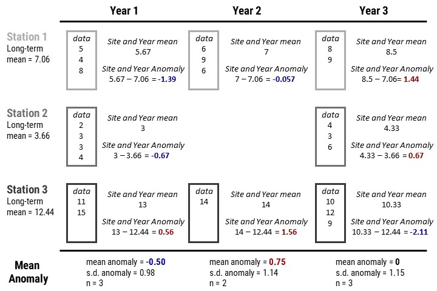
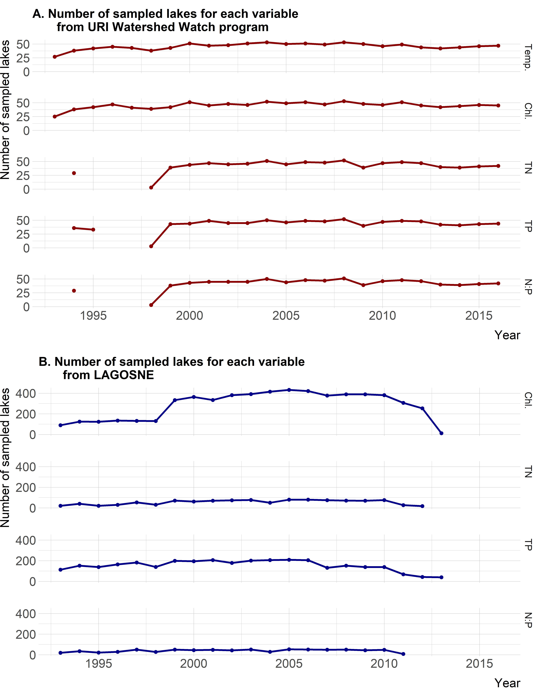
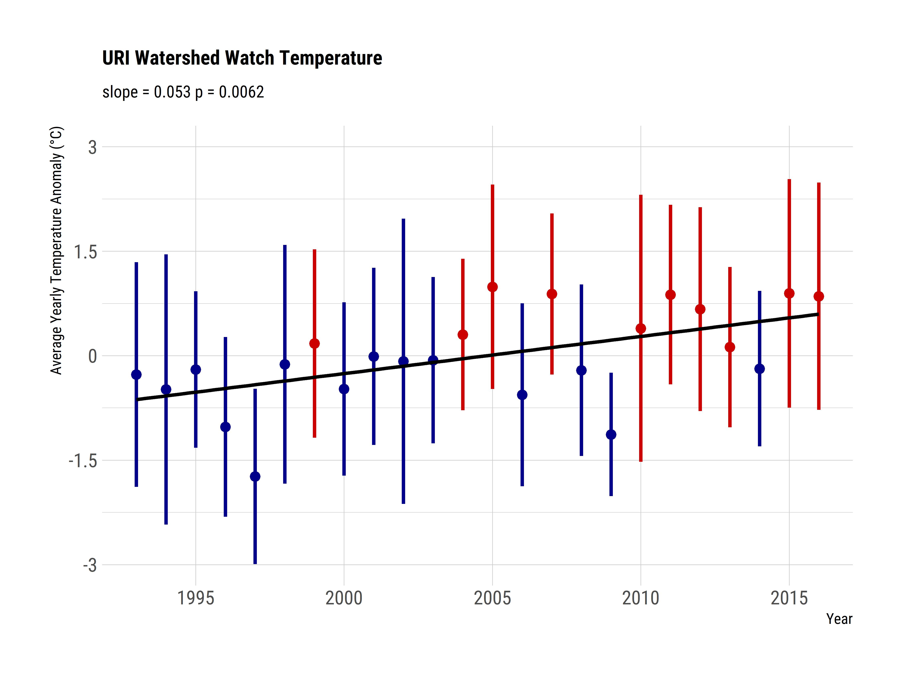
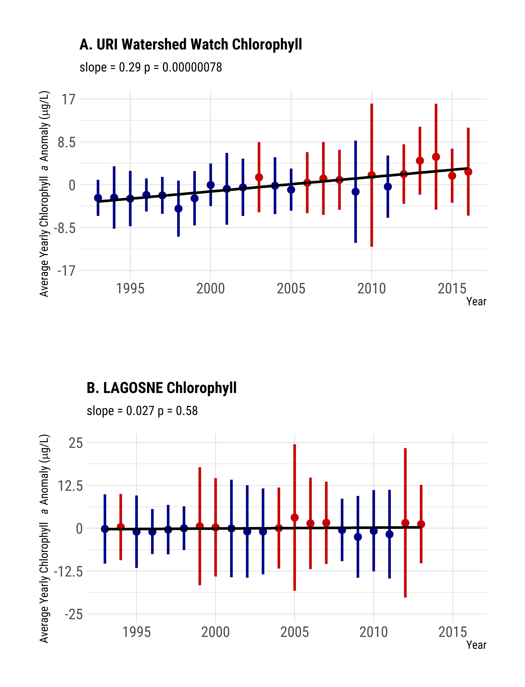
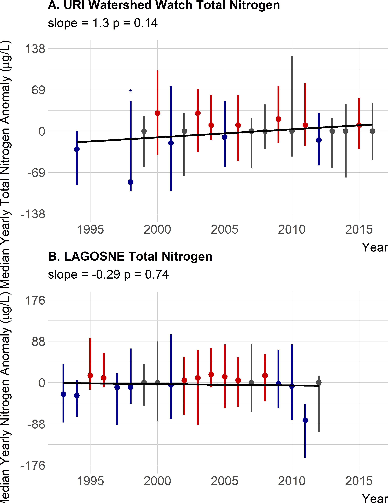
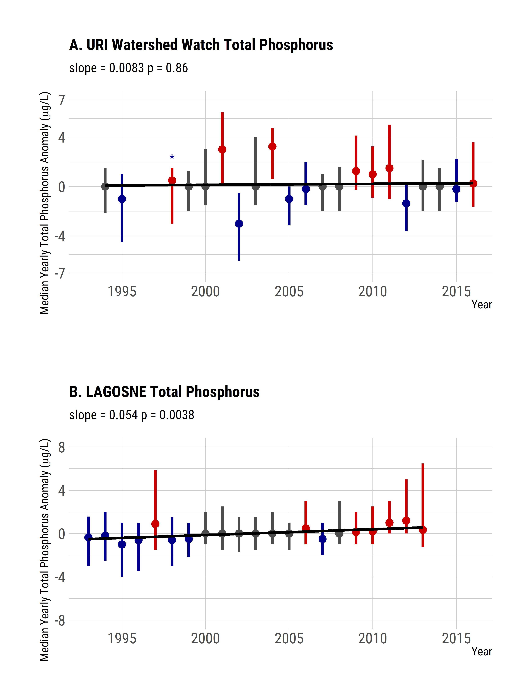
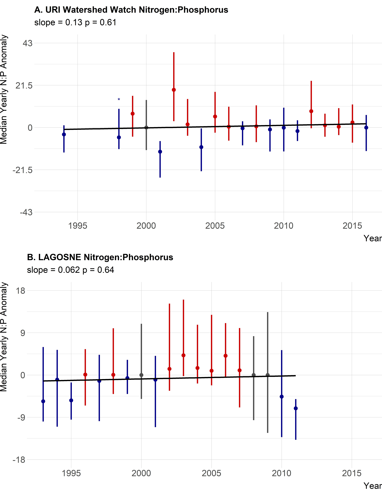
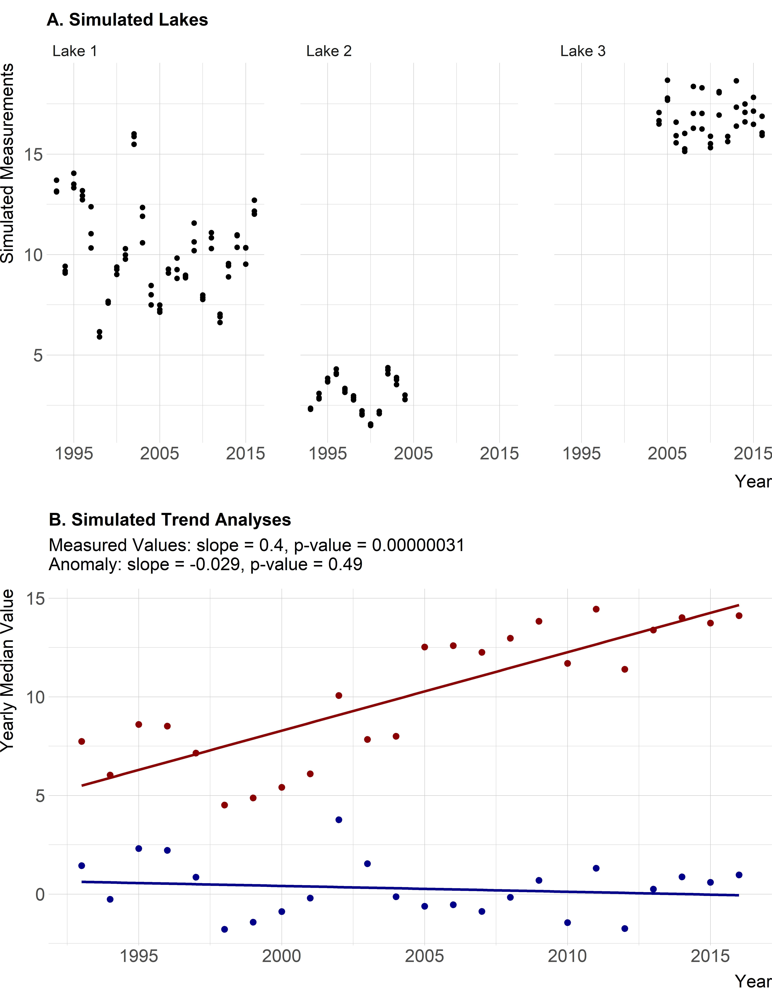

```{r setup, include=FALSE}
source(here::here("R/functions.R"), encoding = "UTF-8")
opts_chunk$set(echo = TRUE, fig.width=6, fig.height=5)
tab_num <- captioner(prefix = "Table")
fig_num <- captioner(prefix = "Figure")
options(scipen=999)
```

```{r analysis, include=FALSE, cache=TRUE}
 source(here::here("R/data_clean.R"), encoding = "UTF-8")
source(here::here("R/data_available.R"), encoding = "UTF-8") 
source(here::here("R/summary_stats.R"), encoding = "UTF-8")  
source(here::here("R/figures_anomaly_only.R"), encoding = "UTF-8")
source(here::here("R/ri_stats.R"), encoding = "UTF-8")
```

# Introduction

Aquatic ecosystems have been altered as the result of human activities modifying nutrient cycling on a global scale [@vitousek1997human; @finlay2013human; @filippelli2008global]. Because of their position in the landscape, lakes can function as integrators and sentinels for these anthropogenic effects [@williamson2008lakes; @schindler2009lakes]. Increasing nutrient inputs, particularly of nitrogen (N) and phosphorus (P), derived from intensive agriculture and densely populated urban areas have contributed to the eutrophication of many lakes [@carpenter1998nonpoint; @smith2003eutrophication].  This eutrophication often leads to an increase in the frequency and severity of harmful algal blooms, greater risks for human and animal health, and potential economic costs associated with eutrophic waters [@michalak2013record; @kosten2012warmer; @taranu2015acceleration; @brooks2016harmful; @dodds2008eutrophication; @paerl2009climate]. To address these problems, management strategies have historically focused on reducing P inputs to lakes, but research also suggests that reducing N inputs may be more effective in certain situations [@paerl2016takes; @schindler2008eutrophication].  These studies indicate that relationships between N, P, and chlorophyll *a* exist and these relationships are spatially and temporally complex.  Thus, long-term data are needed to identify trends at local, regional, and national scales. 

Lake datasets that cover longer time periods and broader spatial scales are now becoming available.  Programs such as the US Environmental Protection Agency's National Lakes Assessment (NLA) provide data that allow for continental-scale water quality analysis. These data allow for analyses that can be useful for managing water resources by developing water quality criteria for N, P, and chlorophyll *a* [@herlihy2013using; @yuan2014managing]. Studying temporal trends across large spatial scales can illustrate the effects of eutrophication such as the degradation of oligotrophic systems as P increases [@stoddard2016continental]. Broad-scale data can also be used for water quality modeling across a range of spatial scales including for predicting lake trophic state, which is indicative of ecosystem condition [@hollister2016modeling; @nojavan2019rethinking]. These trophic state models indicate that landscape variables (e.g., ecoregion, elevation, and latitude) are important and that regional trends exist. Lake-specific drivers have also been shown to be important for predicting continental-scale water quality which adds an additional layer of complexity [@read2015importance]. Despite these challenges, it is important to study lakes at multiple spatial scales because emergent trends on regional or continental scales may or may not be present in individual lakes [@cheruvelil2013multi; @lottig2014long]. 

Previous studies using regional data from the northeastern and midwestern United States (US), approximately 400,000 km^2^ and 1,000,000 km^2^ respectively, have investigated spatial and temporal water quality trends and have demonstrated that drivers explaining changes spatially may not explain changes temporally. These differences may be due to complex interactions occurring at the different scales through time [@lottig2017macroscale]. Additionally, differences between regions can cause nutrient (N and P) trends to have different drivers compared to ratios of the nutrients, and these may or may not align with sub-continental (i.e., ~ 1,800,000 km ^2^) trends [@collins2017lake]. Similarly, trends of N, P, and chlorophyll *a* differ as factors such as land use and climate vary between regions, particularly when comparing the northeastern and midwestern US regions [@filstrup2014regional; @filstrup2018evidence]. Furthermore, little change in nutrients and chlorophyll *a* was reported over a 25 year period for these regions [@Oliver_2017]. Given what is known about long-term trends in water quality within the broader regions of the northeastern and midwestern United States (US), we were curious if the lack of trends was also present in water quality at a sub-regional scale, using data on the 3,000 km^2^ area that encompasses a number of Rhode Island lakes and reservoirs.  

In this study, we focus on the state of Rhode Island for several reasons.  Rhode Island has the second highest population density in the country, yet still has a mix of land use/land cover with developed areas making up ~`r ri_nlcd_data$lulc_perc[ri_nlcd_data$nlcd_class_1 == "Development"]`% of the state, forested areas ~`r ri_nlcd_data$lulc_perc[ri_nlcd_data$nlcd_class_1 == "Forest"]`%, wetlands ~`r ri_nlcd_data$lulc_perc[ri_nlcd_data$nlcd_class_1 == "Wetlands"]`%, and agriculture ~`r ri_nlcd_data$lulc_perc[ri_nlcd_data$nlcd_class_1 == "Planted/Cultivated"]`%. The remainder of the land area is made up other land use/land cover classes.  Given these facts, Rhode Island lakes occur across a gradient of land use/land cover and face a suite of human pressures that most lakes in the nation are also facing with nutrients and pathogens being of particular concern in the state [@ri_2016_waterquality].  Lastly, Rhode Island provides an ideal study area as significant, long-term datasets are available for lakes making it possible to examine water quality trends.       

The goals of this study were to examine ~25 years of lake and reservoir data in Rhode Island and answer two questions.  First, are there state-wide trends in total nitrogen (TN), total phosphorus (TP), total nitrogen to total phosphorus ratio (TN:TP), chlorophyll *a*, and lake temperature? Second, are water quality trends in Rhode Island similar to regional trends in the northeastern United States?  Another objective of this paper was to apply existing methods for examining long-term climate records [e.g., @jones1996calculating] to water quality data in order to examine long-term trends. We conducted this analysis using open data from the URI Watershed Watch program and the LAke multi-scaled GeOSpatial and temporal database for the Northeast (LAGOSNE) project and the analysis in its entirety is available for independent reproduction at <https://github.com/usepa/ri_wq_trends> and is archived at <https://doi.org/10.5281/zenodo.4306765> [@sorannolagosne2017; @stacheleklagosne; @zenodo_citation; @sorannolimno2019].

# Methods

## Study area and data

The study area for this analysis includes lakes and reservoirs in the state of Rhode Island where data were collected by the University of Rhode Island's Watershed Watch program (`r fig_num("ww_map", display = "cite", caption = "Map of URI Watershed Watch lake and reservoir sampling sites")`) which allows for the examination of long-term trends in Rhode Island lakes.   The University of Rhode Island's Watershed Watch (URIWW) is a scientist-led community science program founded in the late 1980s that has built a robust collaboration between URI scientists and a vast network of volunteer monitors.  Volunteer monitors are trained and then collect field data (e.g., sonde measurements or Secchi depth) as well as whole water samples during the growing season (e.g., May through October) for later analysis in the lab.  The entire effort follows rigorous quality control/quality assurance protocols.  These types of community science efforts allow for the collection of reliable data that in turn lead to crucial and frequently unexpected insights [@dickinson2012current; @kosmala2016assessing; @Oliver_2017].  

The URIWW program began in 1988, monitoring 14 lakes and has now grown to include over 250 monitoring locations on over 120 waterbodies, including rivers/streams, and estuaries, with more than 400 trained volunteers. URIWW now provides more than 90% of Rhode Island's lake baseline data and is an integral part of the state's environmental data collection strategy. Data quality assurance and control is treated with paramount importance; volunteers are trained both in the classroom and the field, regular quality checks occur, and volunteers are provided with all the necessary equipment and supplies, along with scheduled collection dates. For freshwater lakes and reservoirs, weekly Secchi depth and water temperature are recorded, along with bi-weekly chlorophyll *a* and in deep lakes (greater than 5 meters) dissolved oxygen. Water samples are collected three times per season (May through October) to be analyzed for nutrients and bacteria.  

For this analysis, we were interested in trends in lake temperature, TN, TP, TN:TP, and chlorophyll *a*.  In particular, we selected URIWW lakes and reservoirs (hereafter, referred to as sites) that matched the following criteria: 1) were sampled between 1993 and 2016, 2) were sampled in May to October, 3) had at least one sampling event per year in May through June, at least one sampling event per year in July through August, and at least one sampling event per year in September through October, 4) had at least one sampling event from 1993-2004 and 2005-2016, and 5) were sampled at a depth of 2 meters or less.  As not all sites have data for all selected years, we further filtered the data to select sites that had at least 10 years of data for a given parameter within the 1993 to 2016 time frame.  The final dataset used in our analysis included `r nrow(ww_avail_data_locations)` lakes and reservoirs.  Of these sites, our filtered dataset had `r length(temp_10yr_sites)` sites measured for temperature, `r length(chla_10yr_sites)` sites measured for chlorophyll *a*, `r length(total_n_10yr_sites)` sites measured for TN, and `r length(total_p_10yr_sites)` sites measured for TP.  Of the `r nrow(ww_avail_data_locations)` sampling sites, `r sum(ww_avail_data_locations$params_avail == "chla, total_p, total_n, np, temp")` had data for all 5 parameters.  The N:P ratio was calculated by dividing the mass concentrations of total nitrogen and total phosphorus and then converting to a molar ratio by multiplying by 2.21 (e.g., atomic weight of P 30.974/atomic weight of N 14.007). 

Field and analytical methods are detailed on the URIWW website at <https://web.uri.edu/watershedwatch/uri-watershed-watch-monitoring-manuals/> and <https://web.uri.edu/watershedwatch/uri-watershed-watch-quality-assurance-project-plans-qapps/>, respectively. These methods, approved by both the state of Rhode Island and the US Environmental Protection Agency, have remained fairly consistent, although over the nearly 30 years changes did occur.  When new methods were introduced, comparisons between old and new methods were conducted and in all cases no statistically significant differences were found with the new methods.  Furthermore, the new methods did at times improve the limits of detection; however, this impacted a very small number (less than 1%) of measurements in this study.  We did run our analyses (see **Water Quality Trend Analysis** section) with all data and with only those data greater than the detection limit.  There was no change in the trend analysis and thus, the results we report are for all data as originally reported in the URIWW dataset.  Given these results, we assume the data to be consistent across the reported time period and appropriate for a long term assessment of trends.

Prior studies have modeled water quality trends across a larger region of the northeastern US within 17 states including Minnesota, Wisconsin, Iowa, Missouri, Illinois, Indiana, Michigan, Ohio, Pennsylvania, New York, New Jersey, Connecticut, Massachusetts, Rhode Island (which includes the URIWW data), Vermont, New Hampshire, and Maine [@soranno2015building; @Oliver_2017]. We repeated our analysis (see **Water Quality Trend Analysis** section) with the same dataset used by Oliver et al. [-@Oliver_2017], the LAGOSNE dataset [@soranno2015building; @stacheleklagosne; @sorannolagosne2017; @sorannolimno2019]. Temperature data were not available, thus we examined trends, using our analytical methods, for TN, TP, TN:TP, and chlorophyll *a* from the LAGOSNE dataset.  We used the same selection criteria on the LAGOSNE dataset as was applied to the URIWW data. This ensured that both datasets represented the same seasonal time frame.  Exact measurement depth for the LAGOSNE data were not available; however, the water quality data are reported to be either surface or epilimnion samples [@sorannolagosne2017]. At the time of our analysis, the LAGOSNE data do not extend beyond 2013 thus sites needed to have a sampling event in 1993-2002 and in 2003-2013 to be included.

We use data, also from LAGOSNE, on landscape composition, maximum lake depth, and lake area [@sorannolagosne2017].  We use the 500 meter buffer landscape composition for three classes from the 2011 National Land Cover Dataset: Agriculture, Forest, and Developed.  The maximum lake depth is from various sources and lake area is calculated from the National Hydrography Dataset waterbody polygons.  Additional details are available in Soranno et al. [-@sorannolagosne2017].

Lastly, data and code for the entire analysis is available from <https://github.com/USEPA/ri_wq_trends/> and is archived at <https://doi.org/10.5281/zenodo.4306765> [@zenodo_citation].  All analyses were conducted with R version 4.0.4 and details on R package versions and operating system used for this analysis are included in a file, `sessioninfo.txt` at <https://github.com/USEPA/ri_wq_trends/blob/master/sessioninfo.txt> [@r2021; @lubridate; @broom; @stringr; @dplyr; @readr; @readxl; @tidyr; @here; @ggplot2; @hrbrthemes; @kendall; @sf; @usaboundaries; @usaboundariesdata; @knitr; @captioner; @pander; @cowplot; @tidycensus; @feddata; @nsink; @units; @xie2015dynamicdoc; @magick; @flextable].  Values included in each of the figures have also been separately saved as a comma-separated values file, `yearly_average_anomaly.csv`, and may be retrieved via <https://github.com/USEPA/ri_wq_trends/blob/master/data/yearly_average_anomaly.csv>.  

## Water quality trend analysis

There are many different methods for analyzing time series data for trends.  Environmental data are notoriously "noisy" and one of the difficulties that is encountered with multiple sampling sites is how to identify a trend while there is variation within a sampling location as well as variation introduced by differing start years for sampling among the many sites.  For instance, if long-term data on water quality were collected more frequently in early years from more pristine waterbodies, then a simple comparison of raw values over time might show a decrease in water quality, which could be misleading if later sampling occurred on both pristine and more degraded water bodies.  Thus, it is necessary to account for this type of within-site and among-site variation.  To do so, we used methods similar to those used to analyze long-term temperature trends using temperature anomalies [e.g., @jones1996calculating].  The general approach we used calculates site-specific deviations from a long-term median over a pre-determined reference period.  This is slightly different than the typical use with temperature anomalies as those usually use the mean instead of the median.  Many of the variables we looked at are non-normal and often have outliers (e.g. algal blooms).  In this case the median is preferred. Using the median with site-specific deviations allows all sites to be shifted to a common baseline and the deviations, or anomalies, indicate change over the specified reference period.  We refer to this method as "site-specific anomalies".

*Summarizing site-specific anomalies:* Methods for calculating the site-specific anomalies and the yearly medians are as follows and are presented graphically in `r fig_num(name = "anomaly_schematic", caption = "Example calculation of the site-specific anomalies and yearly median anomalies.", display = "cite")`.  Additionally, an example R script, `schematic_anomaly.R` and example dataset, `schematic.csv` to recreate and demonstrate the calculations in `r fig_num("anomaly_schematic", display = "cite")` is available from <https://github.com/usepa/ri_wq_trends/blob/master/R/schematic_anomaly.R> and is archived at <https://doi.org/10.5281/zenodo.4306765> [@zenodo_citation].  

The general steps, outlined in `r fig_num("anomaly_schematic", display = "cite")` and listed below, are repeated for each of the water quality parameters.

1. For each site, calculate the annual medians, producing a single median value for each site and year. This step prevents bias from pseudoreplication of multiple measurements of the same site in a given year [@hurlbert1984pseudoreplication].  The per site medians across years are assumed to be independent.
2. Calculate the long-term reference median for each site. This results in a single site-specific long-term median.
3. Calculate the anomaly for each annual median at each site by subtracting the sites reference long-term medians from the sites yearly median.
4. Summarize by calculating the median anomaly per year for the entire group of sites.  The resultant values are analyzed for a trend over time.

```{r get_year_n, echo=FALSE}
year_num_ww <- figure_data %>%
  filter(source == "uriww") %>%
  select(year, variable, n) %>%
  spread(variable, n) %>%
  rename("Year" = "year", "Chlorophyll" = "chla", 
         "Nitrogen:Phosphorus" = "np_ratio", "Temperature" = "temp", 
         "Total Nitrogen" = "total_n", "Total Phosphorus" = "total_p")

year_num_lagosne <- figure_data %>%
  filter(source == "lagosne") %>%
  select(year, variable, n) %>%
  spread(variable, n)  %>%
  rename("Year" = "year", "Chlorophyll" = "chla", 
         "Nitrogen:Phosphorus" = "np_ratio", 
         "Total Nitrogen" = "total_n", "Total Phosphorus" = "total_p")
```

After filtering and summarizing the data some years may not have sufficient number of sites to be included.  We chose to include years in the analysis if they had at least three sites, but years with small numbers of sites are rare and only occurred with the nutrient data very early in the time frame of our analysis for the URIWW data and late in the time frame for the LAGOSNE data (`r fig_num("year_n", display = "cite", caption = "Number of sites available for trend analysis by parameter and year for both URIWW and LAGOSNE.")`). 

*Linear regression on annual median anomalies:* Testing for a regression slope being different than zero can be used to test for monotonic trends in water quality data [@helsel2002statistical].  We used these standard procedures to look for positive or negative trends in lake temperature, chlorophyll *a*, TN, TP and TN:TP.  For each parameter, we fit a regression line to the anomalies as a function of year and tested the null hypothesis that no trend existed (e.g., $\beta$~1~ = 0).  The slope of this line provides information on the average yearly change of that parameter over the time period studied.  

*Assessing regressions for trends:* Traditionally, trends would be determined by assessing "significance" but recent guidelines suggest not using arbitrary p-value cut-offs to assesses significance [@wasserstein2016asa].  Our interpretation of the trends attempts to follow this advice and we assess trends with multiple lines of evidence. For this assessment, we evaluated trends based on the following criteria: 1) p-values are used to determine general levels of statistical support, 2) relative frequency of high and low years in the beginning and end of the time frame are used to identify an increasing or decreasing pattern, and 3) the magnitude of the slope is used to infer an ecologically relevant change.  Using all of this information we determine that a trend exists if it meets at least 2 of the 3 criteria, a weak trend exists if it meets one of the criteria and no trend exists if it meets none of the criteria.  

We recognize that ecologically relevant change is system dependent and no single value will be universally appropriate.  We are using several values for this particular assessment, but other values could also be justified.  There are various ways to identify important temperature changes in lakes and reservoirs.  A policy based approach could examine agreements that attempt to limit temperature increases, such as the Paris Agreement, which aims to limit increases over the next century to 2°C, which would be 0.02°C per year or, the state of Rhode Island criteria for temperature increase is 2.2°C or 0.022°C per year over a century [@paris; @ri_wq_regs]. Alternatively, we could look at more ecologically focused temperature changes.  For instance, Winder and Schindler [-@winder2004climate] saw disrupted trophic linkages between phytoplankton and zooplankton with 1.39°C over a 40 year data set, or 0.035°C per year.  For this study, we will use the 0.02°C per year as it would provide protections against other ecologically relevant changes (e.g. 0.035°C per year for trophic linkages), meet local criteria, and would also be indicative of meeting an important policy goal. 

For changes in chlorophyll, total phosphorus, and total nitrogen, we define an ecologically meaningful trend as one that would result in any oligotrophic lake changing to a mesotrophic state over the course of a century.  We use the values defined by the trophic state limits in Nürnberg [-@nurnberg1996trophic].  For chlorophyll the oligotrophic-mesotrophic limit is 3.5 μg/L and over a century that is 0.035 μg/L per year, for total nitrogen the limit is 350 μg/L, or 3.5 μg/L per year, and the total phosphorus limit is 10 μg/L or 0.1 μg/L per year.  A slope at or above these values would result in a oligotrophic-mesotrophic transition for all oligotrophic lakes, even lakes with the impossible situation of chlorophyll, total nitrogen, or total phosphorus concentrations of zero.

```{r np_thresh, include=FALSE, message=FALSE}
d_and_m_1992 <- read_csv(here::here("data/downing_mccauley_1992_table_3.csv"))
np_thresh <- d_and_m_1992 %>%
  mutate(molar_np = (total_n/total_p) * 2.21) %>%
  group_by(n_lim) %>%
  summarize(median_np = round(median(molar_np),0))
```

An ecologically meaningful trend for TN:TP could be one that would suggest a switch from nitrogen limitation to phosphorus limitation over a century.  To identify this we use information from experimental manipulations of nitrogen in lakes that identify those lakes as being nitrogen limited [@downing1992nitrogen].  In Downing and McCauley [-@downing1992nitrogen], they identified 34 studies and reported whether or not the study found the lake to be nitrogen limited and the ambient total nitrogen and total phosphorus concentration in μg/L.  With this information we calculated a median molar TN:TP ratio for nitrogen limited lakes and for lakes that did not show nitrogen limitation.  The difference between these two values would suggest a possible shift in the limiting nutrients.  The median molar TN:TP for nitrogen limited lakes was `r np_thresh[np_thresh$n_lim == "Yes",]$median_np` and for lakes not limited by nitrogen was `r np_thresh[np_thresh$n_lim == "No",]$median_np`.  The difference between these is `r abs(np_thresh[np_thresh$n_lim == "Yes",]$median_np - np_thresh[np_thresh$n_lim == "No",]$median_np)` and over a century a change of `r abs(np_thresh[np_thresh$n_lim == "Yes",]$median_np - np_thresh[np_thresh$n_lim == "No",]$median_np)/100` per year would be indicative of an ecologically meaningful change.  As we have defined it, slope magnitudes in excess of these per year values (temperature: 0.02, chlorophyll: 0.035, total nitrogen: 3.5, total phosphorus: 0.1, TN:TP: 0.26) will be considered to have an ecologically meaningful trend. 

*Comparison of Rhode Island to the region:* Oliver et al. [-@Oliver_2017] used hierarchical linear models and showed relatively stable water quality in the lakes of the northeastern United States.  While the University of Rhode Island's Watershed Watch data were included in this regional study, we hypothesized that, in the case of Rhode Island, regional trends were masking sub-regional trends.  Therefore, we decided to reanalyze the LAGOSNE data to compare the trends at the regional scale to the trends at the Rhode Island state scale using the site-specific anomaly and trend analysis approach outlined above. 

# Results

Lakes and reservoirs in Rhode Island tended to be smaller and shallower, on average, than lakes included in the complete LAGOSNE region (`r tab_num("context_summ", display = "cite", caption = "Average landscape context and lake morphometry summary statistics for lakes in URIWW and LAGOSNE.")`).  Also, Rhode Island lakes tended to occur in landscapes (i.e. a 500 meter buffer) with a lower average percent agriculture, more developed land, and comparable forested area than lakes in the LAGOSNE region (`r tab_num("context_summ", display = "cite", caption = "Average landscape context and lake morphometry summary statistics for lakes in URIWW and LAGOSNE.")`).

During the period of 1993 to 2016, Rhode Island lakes and reservoirs in our dataset of surface and epilimnion measurements had a median lake temperature of `r paste(ww_param_ranges%>%filter(Parameter == "Temperature")%>%pull(Median), ww_param_ranges%>%filter(Parameter == "Temperature")%>%pull(Units))`, median TN of `r paste(ww_param_ranges%>%filter(Parameter == "Total Nitrogen")%>%pull(Median), ww_param_ranges%>%filter(Parameter == "Total Nitrogen")%>%pull(Units))`, median TP of `r paste(ww_param_ranges%>%filter(Parameter == "Total Phosphorus")%>%pull(Median), ww_param_ranges%>%filter(Parameter == "Total Phosphorus")%>%pull(Units))`, median TN:TP ratio of `r paste(ww_param_ranges%>%filter(Parameter == "N:P")%>%pull(Median), ww_param_ranges%>%filter(Parameter == "N:P")%>%pull(Units))`, and median chlorophyll *a* of `r paste(ww_param_ranges%>%filter(Parameter == "Chlorophyll")%>%pull(Median), ww_param_ranges%>%filter(Parameter == "Chlorophyll")%>%pull(Units))` (`r tab_num("ww_params", display = "cite", caption = "Summary statistics for URI Watershed Watch data from 1993 to 2016.")`).  

For lakes and reservoirs in the larger region represented by the LAGOSNE States,  median TN was `r paste(lagos_param_ranges%>%filter(Parameter == "Total Nitrogen")%>%pull(Median), lagos_param_ranges%>%filter(Parameter == "Total Nitrogen")%>%pull(Units))`, median TP was `r paste(lagos_param_ranges%>%filter(Parameter == "Total Phosphorus")%>%pull(Median), lagos_param_ranges%>%filter(Parameter == "Total Phosphorus")%>%pull(Units))`, median TN:TP ratio was `r paste(lagos_param_ranges%>%filter(Parameter == "N:P")%>%pull(Median), lagos_param_ranges%>%filter(Parameter == "N:P")%>%pull(Units))`, and median chlorophyll *a* was `r paste(lagos_param_ranges%>%filter(Parameter == "Chlorophyll")%>%pull(Median), lagos_param_ranges%>%filter(Parameter == "Chlorophyll")%>%pull(Units))` (`r tab_num("lagos_params", display = "cite", caption = "Summary statistics for LAGOSNE data from 1993 to 2016.")`).    

On average, the Rhode Island lakes and reservoirs show lower concentrations of nutrients with more nitrogen relative to phosphorus than in the larger LAGOSNE region (`r tab_num("ww_params", display = "cite")`, `r tab_num("lagos_params", display = "cite")`).  Chlorophyll concentrations also show lower average concentrations in Rhode Island (`r tab_num("ww_params", display = "cite")`, `r tab_num("lagos_params", display = "cite")`).  Furthermore, the distribution of chlorophyll based trophic state also shows a larger percentage of oligotrophic and mesotrophic lakes in Rhode Island and more eutrophic and hypereutrophic lakes in the larger LAGOSNE region (`r tab_num("ts_table", display = "cite", caption = "Percentage of lakes and reservoirs in different chlorophyll based trophic states.")`; [@nurnberg1996trophic]). These results follow what would be expected given that, on average, LAGOSNE lakes are more dominated by agricultural lands than are Rhode Island lakes (`r tab_num("context_summ", display = "cite", caption = "Average landscape context and lake morphometry summary statistics for lakes in URIWW and LAGOSNE.")`).

## State-wide trends in water quality

Median annual temperature anomalies in lakes and reservoirs appear to be increasing as the slope is greater than the threshold of 0.02 we identified, the p-value suggests some statistical support for a positive trend (slope = `r signif(ww_temp_rl$slope,2)` , p = `r signif(ww_temp_rl$p.value, 2)`), and the majority of years with median temperature greater than the long-term median are occurring in the second half of the time period (`r fig_num(name = "temp_ri", caption = "Twenty year trend for median lake temperature anomaly in Rhode Island. Points are medians of site-specific anomalies and ranges are the 25th and 75th percentiles. Blue indicates yearly site-specific anomalies that were below the site-specific long-term medians. Red indicates yearly site-specific anomalies that were above the site-specific long-term medians. Black line is the linear fit for year and median anomaly.", display = "cite")`, `r tab_num(name = "trend_summ", caption = 'Summary of long term water quality trends in the URIWW and LAGOSNE data for termperature (Temp.) chlorophyll (Chl.), total nitrogen (TN), total phosphorus (TP), and the molar nitrogen to phosphorus ratio (N:P). The "++" indicate a positive trend, the "+" indicates a weak positive trend, and the "0" indicates no trend.', display = "cite")`).  Chlorophyll *a* is also showing an increasing trend over time (slope = `r signif(ww_chla_rl$slope,2)` , p = `r signif(ww_chla_rl$p.value, 2)`).  The slope of `r signif(ww_chla_rl$slope,2)` μg/L is greater than our threshold of 0.035 μg/L and the above-average years have mostly occurred in the most recent years (`r fig_num(name = "chla_trend", caption = "Twenty year trend for median chlorophyll anomaly.  Panel A. URI Watershed Watch yearly chlorophyll anomalies.  Panel B. LAGOSNE yearly chlorophyll anomalies. Points are medians of site-specific anomalies and ranges are the 25th and 75th percentiles. Blue indicates yearly site-specific anomalies that were below the site-specific long-term medians. Red indicates yearly site-specific anomalies that were above the site-specific long-term medians. Black line is the linear fit for year and median anomaly.", display = "cite")`A., `r tab_num(name = "trend_summ", display = "cite")`). 

```{r no_early_tn, echo=FALSE}
ww_tn_rl_noearly <- lm(mdn_value~year, data = ww_tn_df[ww_tn_df$n > 3,]) %>%
  tidy() %>%
  slice(2) %>%
  select(slope = estimate, p.value)
```

```{r no_early_tp, echo=FALSE}
ww_tp_rl_noearly <- lm(mdn_value~year, data = ww_tp_df[c(-1,-2,-3),]) %>%
  tidy() %>%
  slice(2) %>%
  select(slope = estimate, p.value)
```

Median annual trends for nutrients were not as clear. For total nitrogen, the slope of the line is positive with some, albeit weak, statistical support (slope = `r signif(ww_tn_rl$slope,2)` , p = `r signif(ww_tn_rl$p.value, 2)`) but the years greater than the median are distributed evenly throughout time.  Also, a slope of `r signif(ww_tn_rl$slope,2)` μg/L per year is lower than our threshold value of 3.5 μg/L suggesting little support for a meaningful ecological change over time (`r fig_num(name = "tn_trend", caption = "Twenty year trend for median TN anomaly.  Panel A. URI Watershed Watch yearly TN anomalies.  Panel B. LAGOSNE yearly TN anomalies. Points are medians of site-specific anomalies and ranges are the 25th and 75th percentiles. Blue indicates yearly site-specific anomalies that were below the site-specific long-term medians. Red indicates yearly site-specific anomalies that were above the site-specific long-term medians.  Grey indicates yearly site-specific anomalies that were equal to the long-term medians.  Missing years had insufficient data and an asterisk indicates years with only 3 sites and error bars are the range of the data.  Black line is the linear fit for year and median anomaly.", display = "cite")`A). Also, 1998 only had three sites with available total nitrogen data and may not be representative.  This year also recorded the lowest median value.  Thus, 1998 may be skewing these results.  When this year is removed, the slope of the line is `r signif(ww_tn_rl_noearly$slope,2)` and the p-value is `r signif(ww_tn_rl_noearly$p.value, 2)`.  Thus, we interpret this as no trend in total nitrogen (`r tab_num(name = "trend_summ", display = "cite")`). Total phosphorus shows essentially no trend over time in the yearly anomalies with little statistical support (slope = `r signif(ww_tp_rl$slope,2)` , p = `r signif(ww_tp_rl$p.value, 2)`) and years that are over the median do not show any pattern (`r fig_num(name = "tp_trend", caption = "Twenty year trend for median TP anomaly.  Panel A. URI Watershed Watch yearly TP anomalies.  Panel B. LAGOSNE yearly TP anomalies. Points are medians of site-specific anomalies and ranges are the 25th and 75th percentiles. Blue indicates yearly site-specific anomalies that were below the site-specific long-term medians. Red indicates yearly site-specific anomalies that were above the site-specific long-term medians.Grey indicates yearly site-specific anomalies that were equal to the long-term medians.  Missing years had insufficient data and an asterisk indicates years with only 3 sites and error bars are the range of the data.  Black line is the linear fit for year and median anomaly.", display = "cite")`A., `r tab_num(name = "trend_summ", display = "cite")`). Also a change of `r signif(ww_tp_rl$slope,2)` μg/L per year is much less than our defined threshold of 0.1 μg/L.  The TN:TP ratio has a small slope, very little statistical support, no pattern in the above and below years, and a slope magnitude less than 0.26 (slope = `r signif(ww_np_rl$slope,2)`, p = `r signif(ww_np_rl$p.value,2)`) suggesting little evidence for a change in the concentrations of TN relative to the concentrations of TP (`r fig_num(name = "np_trend", caption = "Twenty year trend for median TN:TP anomaly.  Panel A. URI Watershed Watch yearly TN:TP anomalies.  Panel B. LAGOSNE yearly TN:TP anomalies. Points are medians of site-specific anomalies and ranges are the 25th and 75th percentiles. Blue indicates yearly site-specific anomalies that were below the site-specific long-term medians. Red indicates yearly site-specific anomalies that were above the site-specific long-term medians.Grey indicates yearly site-specific anomalies that were equal to the long-term medians.  Missing years had insufficient data and an asterisk indicates years with only 3 sites and error bars are the range of the data.  Black line is the linear fit for year and median anomaly.", display = "cite")`A., `r tab_num(name = "trend_summ", display = "cite")`).  

## Regional trends in water quality

In general, there was little evidence to suggest broad regional changes in chlorophyll *a* as it showed a very weak positive trend, slight statistical support and above average years spread evenly throughout the time period (slope = `r signif(lagos_chla_rl$slope,2)`, p = `r signif(lagos_chla_rl$p.value, 2)`, `r fig_num(name = "chla_trend", display = "cite")`B., `r tab_num(name = "trend_summ", display = "cite")`).  Total nitrogen showed a slight decreasing trend with weak statistical support and slope less than the 3.5 μg/L that would result in a trophic state change over a century, thus there is little support for a meaningful trend in TN at the regional scale (slope = `r signif(lagos_tn_rl$slope, 2)`, p = `r signif(lagos_tn_rl$p.value, 2)`, `r fig_num(name = "tn_trend", display = "cite")`B., `r tab_num(name = "trend_summ", display = "cite")`).  Furthermore, The last two years for which LAGOSNE had data on total nitrogen were from a relatively smaller number of sites (`r fig_num("year_n", display = "cite")`) and those values may not be representative.  Total phosphorus showed a very small increasing trend and there is statistical support for that trend.  The slope however suggests little support for an ecological meaningful change in total phosphorus (slope = `r signif(lagos_tp_rl$slope, 2)`, p = `r signif(lagos_tp_rl$p.value,2)`, `r fig_num(name = "tp_trend", display = "cite")`B., `r tab_num(name = "", display = "cite")`). Lastly, the TN:TP ratio showed little change (slope = `r signif(lagos_np_rl$slope, 2)`, p = `r signif(lagos_np_rl$p.value, 2)`, `r fig_num(name = "np_trend", display = "cite")`B., `r tab_num(name = "
", display = "cite")`) as none of our criteria for a trend were met.  Although, there appears to be a non-linear trend that suggests increasing TN:TP early in the time period and decreasing TN:TP later, we feel we cannot effectively evaluate this though as total nitrogen measurements were rare in 2011 (`r fig_num("year_n", display = "cite")`) and sites that had both nitrogen and phosphorus were even rarer.  This low median anomaly should be interpreted with this caveat in mind.   Taken together we feel our results largely match the findings of Oliver et al. [-@Oliver_2017] that there is stasis in lake nutrients and chlorophyll within the LAGOSNE region. 


# Discussion and Conclusions

Our sub-regional analysis indicates that increases in primary production, as measured by chlorophyll *a*, occurred over the ~25 years of our study period.  Over the same period we also demonstrate long-term warming of Rhode Island lakes and reservoirs. Chlorophyll has increased, on average, `r signif(ww_chla_rl$slope, 2)` μg/L per year over the 23 years of our analysis, while temperature has increased `r signif(ww_temp_rl$slope, 2)` °C per year over the same period.  Trends in nutrients suggested little change. Total nitrogen, total phosphorus, and the nitrogen:phosphorus ratio all showed no evidence of trends.   While our analysis is not capable of detecting causation, that both chlorophyll *a* and temperature is increasing with less obvious trends in nutrients is interesting and warrants further exploration to see if increasing chlorophyll *a* can be described by temperature.  Also, geographic extent does indeed matter when trying to identify long-term water quality trends. Similar to the results of Oliver et al. [-@Oliver_2017] our analysis shows little increasing trend in chlorophyll *a* at the regional scale (e.g., northeastern and mid-western United States).  However, at the more localized scale of the state of Rhode Island, there is a clear increasing trend in chlorophyll *a*.

## Trends

As previously mentioned, both temperature and chlorophyll *a* show increasing trends from 1993 to 2016 in Rhode Island lakes and reservoirs (`r tab_num(name = "trend_summ", display = "cite")`).  However, 2006 and 2009 stand out as not following this trend for temperature.  Average May-October air temperature for 2009 was third lowest on record for the 1993 to 2016 time period and also showed the lowest maximum temperatures [@noaatrends].  On the other hand, 2006 was not unusually cool (11th lowest out of 24 years) but it was the wettest year on record for this period [@noaatrends].  These unusual weather patterns may help explain why 2006 and 2009 did not follow the trend.  

Trends in total nutrients and the TN:TP ratio are less clear.  While TN showed a weak positive trend, data for the early years (1994-1998) were sparse.  There is no ecological or statistical trend in the years with consistently available data.  The general picture in Rhode Island appears to be no increase in nitrogen, no trend in phosphorus and little to no change in the TN:TP ratio (`r tab_num(name = "trend_summ", display = "cite")`).  We interpret these results as relative stability in nutrients in Rhode Island lakes and reservoirs. 

Stable nutrient regimes may be partly explained by efforts to curb nutrient loadings, for example through voluntary and state wide mandatory bans on phosphates in laundry detergent which were implemented in Rhode Island in 1995 [@riphosban1995; @litke1999review].  However, these nutrient reductions may not result in nutrient limitation and when when faced with other changes (e.g. temperature increases) increasing chlorophyll *a* may still occur.  Additionally, our analysis point to the fact that chlorophyll *a* and algal biomass is driven by processes operating at different scales.  For instance, nutrient management is largely a local to watershed scale effort, but may also be regional as atmospheric nitrogen deposition can be a significant source of nitrogen [@boyer2002anthropogenic].  Similarly, warming lakes are driven by broader climate patterns, yet waterbody-specific factors such as the percent of impervious surface in a catchment and lake morphology can also impact temperature [@nelson2007stream]. In short, differences in regional and state level trends are driven by complex and multi-scale processes.  

In addition to the sub-regional annualized trends of the five variables we address with this study, other trends may also be of interest.  For example, a lengthening of the growing season could increase the number of days with conditions that favor the growth of harmful algal blooms as cyanobacteria grow better at temperatures greater than than 25°C [@paerl2008blooms; @johnk2008summer; @reynolds2006ecology].  Many national and regional studies have also documented longer growing seasons [e.g., @vega2019changes; @cooter1995recent; @kunkel2004temporal].  Evidence in Rhode Island also points to possible lengthening of the growing season as both May and October, the beginning and end of the sampling dates in our dataset, show increasing temperature trends over time [@noaatrends].  Furthermore, preliminary analysis of the URIWW data supports the idea that growing seasons may be getting longer in Rhode Island.    Early in our study period (1993-1995), the average first day of lake temperatures exceeding 25°C was June 11th, at the end of our study period (2014-2016) these warmer temperature were seen, on average, on June 1st.  A site-specific anomaly analysis of growing season length could shed further light on potential changes to growing seasons in Rhode Island lakes.

Trends, and their ecological importance, could also vary depending on trophic state of a given waterbody.  We identified a minimum ecologically important change of 0.035 µg/l per year of chlorophyll.  This magnitude of change would result in a shift for any oligotrophic lake to a mesotrophic state; whereas, for any mesotrophic lake to become eutrophic over a century would require a change of 0.055 µg/l per year.  Examining these trends by trophic state provides the ability to look for ecologically important changes across the range of trophic state and not rely only on a single rate for all lakes.  Furthermore, Stoddard et al. [-@stoddard2016continental] report an 18.2% reduction in the number of oligotrophic lakes in the United States from 2007 to 2012.  A site-specific anomaly analysis by trophic state would identify trends, such as those seen in Stoddard et al. [-@stoddard2016continental], that might be occurring only on oligotrophic lakes.   A full analysis and interpretation of trends by trophic state is beyond the scope of this study.  However, we conducted a preliminary analysis of chlorophyll trends in Rhode Island for oligotrophic and hypereutrophic lakes which showed increasing chlorophyll trends for both trophic states but the yearly increase was much greater in the hypereutrophic lakes. This suggests that a full analysis of how lakes in different trophic states are changing over time is warranted.  

## Broader implications

There are several broader implications from the results of our analysis and of examining long-term water quality trends in general. First, as more long-term datasets become available, it is important for managers, stakeholders, and researchers to work together to better understand long-term water quality trends at multiple spatial scales.  Specifically for this study, the results provide feedback to long time volunteer monitors about the trends in long-term, volunteer collected data.  This type of feedback is important in maintaining involvement as it has been shown in other areas that contributing to science and management is one of the expectations for some community science volunteers and can help maintain longer-term involvement [@ganzevoort2017sharing; @bonney2009citizen; @gouveia2004promoting].  If long-term involvement was not common, then consistent long-term data may be difficult to obtain and understanding of long-term trends would be challenging.

Second, with information on long-term trends, it is possible to adapt management approaches to address areas of concern.  Our results show increasing chlorophyll *a* and increasing temperature even though the general long-term nutrient trends have been less clear.  While the analysis described here can not be used to infer causation, it points to areas that may need to be addressed.  For instance, warming waters are linked to increases in harmful algal blooms [@paerl2008blooms; @paerl2009climate; @paerl_climate_2012].  An increase in blooms could be assumed via increasing chlorophyll *a* levels as chlorophyll *a* has been linked to probability of the presence of bloom indicators such as microcystin [@Hollister_2016].   Our results are consistent then with the prior research that temperature changes could be driving increased chlorophyll.

Our analysis has shown warming lakes in Rhode Island, but broad scale warming of lakes has also been documented and shown to be a result of both climatic and local drivers and can vary greatly within regions [e.g., @oreilly2015warming].  Given that the drivers of warming are at both broad and local scales, managing warming lake temperatures will be a difficult task.  Counteracting the impacts of continued warming on increased chlorophyll in lakes will, at a minimum, require additional interventions. Reducing nutrient loads below current levels is one such intervention and could be achieved via source controls, enhanced entrainment of surface waters, treatment through green infrastructure, or in-lake approaches such as restoration of freshwater mussels [@yang2018nutrients; @kellogg2010geospatial; @pennino2016watershed; @reisinger2019changes; @kreeger2018restoration].  In any event, controlling future eutrophication and protecting against harmful aglal blooms will continue to be a challenge against the backdrop of warming lakes.

## Data analysis approach

The analysis approach we used here, site-specific anomalies, is not a novel method and does have a long history in the analysis of trends in climate [@hansen2006global; @hansen2010global; @jones1996calculating; @jones1999surface]. However, using it to examine water quality trends is a little-used application of the technique, as we only found a single study using anomalies in lakes and that study's focus was only on lake temperature [@oreilly2015warming]. There is little evidence of using anomalies more broadly with water quality trends.  Thus, we built on these methods and adapted them for use with long-term water quality trends.  While other methods are valid and robust [e.g., @Oliver_2017], we chose median site-specific anomalies as they can provide readily interpretable results, especially for communicating to general audiences.  For instance, reporting the changes in anomalies allows us to look at changes in the original units.  With our analysis, the slope of the regression line for temperature suggests an average yearly increase of `r signif(ww_temp_rl$slope, 2)` °C and the slope of the regression line for chlorophyll *a* shows an average yearly increase of `r signif(ww_chla_rl$slope, 2)` µg/l.  

The site-specific anomalies are also robust to variations in sampling effort and in the timing of inclusion of given sampling locations.  For instance, if a site included only early in a time period had low values and a site included late in the time period had high values, then analyzing the measured values over this time period would show an increase whether or not one existed.  Using the site-specific anomalies rescales the values and allows the real trend to be seen.  We illustrate this with simulated, random data (e.g. no site-specific trend) (`r fig_num(name = "simulated", caption = "Panel A. Simulated, random data showing example of three hypothetical lakes; one lake was monitored throughout the record, one lake with low reported values monitored early in the record, and another lake with high reported values monitored late in the record.  Panel B. Analysis of simulated, random data with one lake monitored throughout the record, one lake with low reported values monitored early in the record, and another lake with high reported values monitored late in the record. Yearly average of the actual values is shown in red and yearly average of the site-specific anomalies is shown in blue.", display = "cite")`A), and apply the site-specific analysis to those simulated data (`r fig_num(name = "simulated", display = "cite")`B).  The average of the yearly measured values shows a trend (slope = `r signif(meas_lm$slope, 2)` and p-value = `r signif(meas_lm$p.value, 2)`), whereas the site-specific anomalies correctly shows no trend as each site did not change over time (slope = `r signif(anom_lm$slope, 2)` and p-value = `r signif(anom_lm$p.value, 2)`, `r fig_num(name = "simulated", display = "cite")`).  

Site-specific anomalies do have broad utility for the analysis of water quality trends, however; there are a few caveats the must be considered.  Our use of site-specific anomalies as outlined in this paper, requires aggregating over years.  Any time period could be used for aggregating, but this is a decision that will need to be carefully addressed when conducting this type of analysis.  Site-specific anomalies also require fairly large amounts of data.  The required data will need to be consistently collected over a long period of time.  Ideally, the data would cover a reference period (e.g. for our analysis that was 24 years) although other data could possibly be used to estimate the long-term medians.  In short, site-specific anomalies do require relatively large datasets and decisions on appropriate levels of aggregation, as with any analysis using aggregation, must be made carefully.   

Lastly, this analysis is only possible because of the availability of sound, long-term data on water quality in Rhode Island.  Without the URIWW data and the commitment and participation of more than 2500 volunteers over the years, our analyses would have been impossible.  Going forward, it is important to appreciate the role that volunteer monitoring and community science programs can play in capturing and better understanding long-term environmental trends. 

# Acknowledgments

We would like to thank Anne Kuhn (US EPA, Atlantic Coastal Environmental Sciences Division), Nate Merrill (US EPA, Atlantic Coastal Environmental Sciences Division), Jim Hagy (US EPA, Gulf Ecosystem Measurement and Modeling Division), Joe LiVolsi (US EPA, Atlantic Coastal Environmental Sciences Division), Tim Gleason (US EPA, Atlantic Coastal Environmental Sciences Division), and Wayne Munns (US EPA, Atlantic Coastal Environmental Sciences Division) for constructive reviews of this paper. The URIWW program has received generous support from many different organization over its 25+ year history and we are grateful for this support.  In particular, RI DEM and URI’s Cooperative Extension have provided sustained support for the program and deserve special mention.  In part, this work was supported by the USDA National Institute of Food and Agriculture, McIntire Stennis project accession no. RI0020-MS984.  The views expressed in this article are those of the authors and do not necessarily represent the views or policies of the U.S. Environmental Protection Agency.  Any mention of trade names, products, or services does not imply an endorsement by the U.S. Government or the U.S. Environmental Protection Agency. The EPA does not endorse any commercial products, services, or enterprises. This contribution is identified by the tracking number ORD-032695 of the Atlantic Coastal Environmental Sciences Division, Office of Research and Development, Center for Environmental Measurement and Modeling, US Environmental Protection Agency.

# Bibliography

<div id="refs"></div>

######

# Tables

```{r context, echo=FALSE, results="asis"}
#knitr::kable(context_summ, format = "pipe")
flextable(context_summ) %>%
  width(width = 1) %>%
  fontsize(size = 11, part = "all") %>%
  bold(part = "header") %>%
  font(fontname = "Times New Roman", part = "all") %>%
  autofit()
```
`r tab_num("context_summ")`

######

```{r ww_params, echo=FALSE, results="asis"}
#knitr::kable(ww_param_ranges, format = "pipe")
flextable(ww_param_ranges) %>%
  width(width = 1) %>%
  fontsize(size = 11, part = "all") %>%
  bold(part = "header") %>%
  font(fontname = "Times New Roman", part = "all") %>%
  autofit()
```
`r tab_num("ww_params")`

######

```{r lagos_params, echo=FALSE, results="asis"}
#knitr::kable(lagos_param_ranges, format = "pipe")
flextable(lagos_param_ranges) %>%
  width(width = 0.5) %>%
  fontsize(size = 11, part = "all") %>%
  bold(part = "header") %>%
  font(fontname = "Times New Roman", part = "all") %>%
  autofit()
```
`r tab_num("lagos_params")`

######

```{r ts_table, echo=FALSE, results="asis"}
#knitr::kable(ts_table, format = "pipe")
flextable(ts_table) %>%
  width(width = 1.2) %>%
  fontsize(size = 11, part = "all") %>%
  bold(part = "header") %>%
  font(fontname = "Times New Roman", part = "all") %>%
  autofit()
```
`r tab_num("ts_table")`

######

```{r trend_summ, echo=FALSE, results="asis"}

trend_summ_df <- tibble(Source = c("URIWW", "LAGOSNE"), 
                        Temp. = c("++", ""), Chl. = c("++", "0"), 
                        `TN` = c("0", "0"), 
                        `TP`= c("0", "+"), 
                        `N:P` = c("0", "0"))


#knitr::kable(trend_summ_df, format = "pipe")
flextable(trend_summ_df) %>%
  width(width = 1) %>%
  fontsize(size = 11, part = "all") %>%
  bold(part = "header") %>%
  font(fontname = "Times New Roman", part = "all") %>%
  autofit()
```
`r tab_num("trend_summ")`

######

# Figures


`r fig_num("ww_map", caption = "Map of URI Watershed Watch lake and reservoir sampling sites")`

######


`r fig_num("anomaly_schematic")`

######



`r fig_num("year_n")`

######


`r fig_num(name = "temp_ri")`

######


`r fig_num(name = "chla_trend")`

######


`r fig_num(name = "tn_trend")`

######


`r fig_num(name = "tp_trend")`

######


`r fig_num(name = "np_trend")`

######


`r fig_num("simulated")`


```{r session_info, echo=FALSE}
#Send session info to a file: 
capture.output(sessionInfo(),file=here::here("sessioninfo.txt"))
```