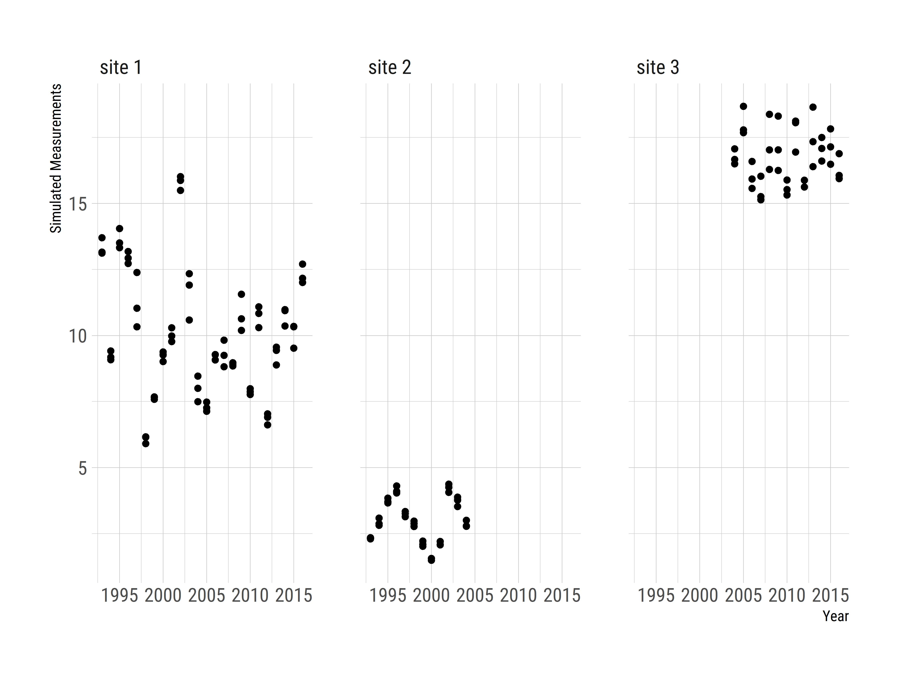
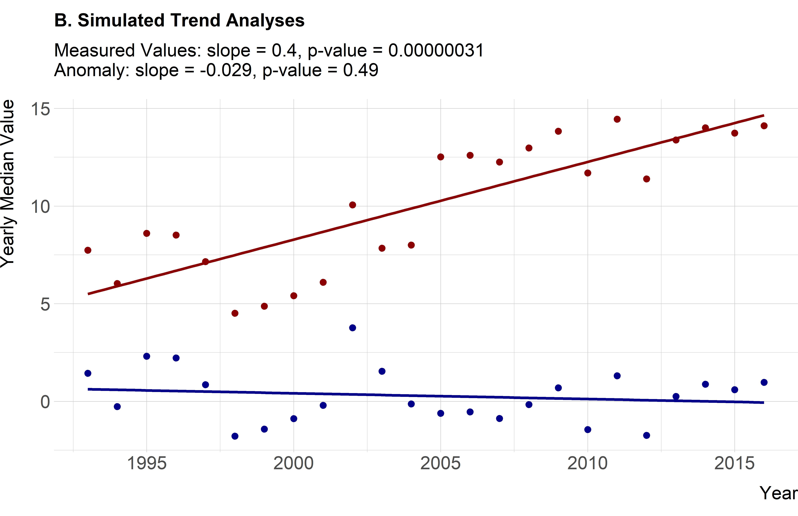

```{r setup, include=FALSE}
source(here::here("R/functions.R"), encoding = "UTF-8")
opts_chunk$set(echo = TRUE, fig.width=6, fig.height=5)
tab_num <- captioner(prefix = "Table")
fig_num <- captioner(prefix = "Figure")
options(scipen=999)
```

```{r analysis, include=FALSE}
source(here::here("R/data_available.R"), encoding = "UTF-8") 
source(here::here("R/summary_stats.R"), encoding = "UTF-8")  
source(here::here("R/figures_anomaly_only.R"), encoding = "UTF-8")
```

# Introduction

Aquatic ecosystems have been altered as the result of human activities modifying nutrient cycling on a global scale [@vitousek1997human; @finlay2013human; @filippelli2008global]. Because of their position in the landscape, lakes can function as integrators and sentinels for these anthropogenic effects [@williamson2008lakes; @schindler2009lakes]. Increasing nutrient inputs, particularly of nitrogen (N) and phosphorus (P), derived from intensive agriculture and densely populated urban areas have contributed to the eutrophication of many lakes [@carpenter1998nonpoint; @smith2003eutrophication].  This eutrophication often leads to an increase in the frequency and severity of harmful algal blooms, greater risks for human and animal health, and potential economic costs associated with eutrophic waters [@michalak2013record; @kosten2012warmer; @taranu2015acceleration; @brooks2016harmful; @dodds2008eutrophication; @paerl2009climate]. To address these problems, management strategies have historically focused on reducing P inputs to lakes, but research also suggests that reducing N inputs may be more effective in certain situations [@paerl2016takes; @schindler2008eutrophication].  These studies indicate that relationships between N, P, and chlorophyll *a* exist and these relationships are spatially and temporally complex.  Thus, long-term data are needed to identify trends at local, regional, and national scales. 

Lake datasets that cover longer time periods and broader spatial scales are now becoming available.  Programs such as the US Environmental Protection Agency's National Lakes Assessment (NLA) provide data that allow for continental-scale water quality analysis. These data allow for analyses that can be useful for managing water resources by developing water quality criteria for N, P, and chlorophyll *a* [@herlihy2013using; @yuan2014managing]. Studying temporal trends across large spatial scales can illustrate the effects of eutrophication such as the degradation of oligotrophic systems as P increases [@stoddard2016continental]. Broad-scale data can also be used for water quality modeling across a range of spatial scales including for predicting lake trophic state, which is indicative of ecosystem condition [@hollister2016modeling; @nojavan2019rethinking]. These trophic state models indicate that landscape variables (e.g., ecoregion, elevation, and latitude) are important and that regional trends exist. Lake-specific drivers have also been shown to be important for predicting continental-scale water quality which adds an additional layer of complexity [@read2015importance]. Despite these challenges, it is important to study lakes at multiple spatial scales because emergent trends on regional or continental scales may or may not be present in individual lakes [@cheruvelil2013multi; @lottig2014long]. 

Previous studies using regional data from the northeastern and midwestern United States (US) have investigated spatial and temporal water quality trends and have shown differences based on scale. Macro-scale (i.e., subcontinental) drivers of water quality trends are complex and may vary temporally [@lottig2017macroscale]. This complexity can cause nutrient (N and P) trends to have different drivers than ratios of the nutrients [@collins2017lake]. On a regional scale, trends of N, P, and chlorophyll *a* differ as factors such as land use and climate vary between regions, particularly when comparing the northeastern and midwestern US [@filstrup2014regional; @filstrup2018evidence]. Thus, it was surprising when little change in nutrients and chlorophyll *a* was reported over a 25 year period for these regions [@Oliver_2017]. Given what is known about long-term trends in water quality within the broader region of the northeastern United States (US), we were curious if the lack of trends was also present in water quality at a sub-regional scale, using data on the 3,000 km^2^ area that encompasses a number of Rhode Island lakes and reservoirs.  

Examining long-term trends in Rhode Island lakes is possible because of the data gathered by University of Rhode Island’s Watershed Watch (URIWW).   URIWW is a scientist-led citizen science program founded in the late 1980s that has built a robust collaboration between URI scientists and a vast network of volunteer monitors.  Volunteer monitors are trained and then collect *in situ* data as well as whole water samples during the growing season (e.g., May through October).  The entire effort follows rigorous quality control/quality assurance protocols.  These types of citizen science efforts allow for the collection of reliable data that in turn lead to crucial and frequently unexpected insights [@dickinson2012current; @kosmala2016assessing; @Oliver_2017].  URIWW data contributed to the larger regional study by Oliver et al. [-@Oliver_2017], and, also allowed us to examine the long-term trends specifically in Rhode Island.

The goals of this study were to examine ~25 years of lake and reservoir data in Rhode Island and answer two questions.  First, are there state-wide trends in total nitrogen (TN), total phosphorus (TP), total nitrogen to total phosphorus ratio (TN:TP), chlorophyll *a*, and lake temperature? Second, are water quality trends in Rhode Island similar to regional trends in the northeastern United States?  Another objective of this paper was to apply existing methods for examining long-term climate records [e.g., @jones1996calculating] to water quality data in order to examine long-term trends. We conducted this analysis using open data from the URI Watershed Watch program and the LAke multi-scaled GeOSpatial and temporal database for the Northeast (LAGOSNE) project and the analysis in its entirety is available for independent reproduction at <https://github.com/usepa/ri_wq_trends> and is archived at <https://doi.org/10.5281/zenodo.3662828> [@sorannolagosne2017; @stacheleklagosne2017; @zenodo_citation; @sorannolimno2019].

# Methods

## Study Area and Data

The study area for this analysis includes lakes and reservoirs in the state of Rhode Island where data were collected by the University of Rhode Island's Watershed Watch program (`r fig_num("ww_map", display = "cite", caption = "Map of URI Watershed Watch lake and reservoir sampling sites")`).  The URIWW program began in 1988, monitoring 14 lakes and has now grown to include over 250 monitoring sites on over 120 waterbodies, including rivers/streams, and estuaries, with more than 400 trained volunteers. URIWW now provides more than 90% of Rhode Island's lake baseline data and is an integral part of the state's environmental data collection strategy. Data quality assurance and control is treated with paramount importance; volunteers are trained both in the classroom and the field, regular quality checks occur, and volunteers are provided with all the necessary equipment and supplies, along with scheduled collection dates. For freshwater lakes and reservoirs, weekly Secchi depth and water temperature are recorded, along with bi-weekly chlorophyll *a* and in deep lakes (greater than 5 meters) dissolved oxygen. Water samples are collected three times per season (May through October) to be analyzed for nutrients and bacteria.  

For this analysis, we were interested in trends in lake temperature, TN, TP, TN:TP, and chlorophyll *a*.  In particular, we selected URIWW sites that matched the following criteria: 1) were sampled between 1993 and 2016, 2) were sampled in May to October, 3) had at least one sampling event in each of May/June, July/August, and September/October, 4) had at least one sampling event from 1993-2004 and 2005-2016, 5) and were sampled at a depth of 2 meters or less.  As not all sites have data for all selected years, we further filtered the data to select sites that had at least 10 years of data for a given parameter within the 1993 to 2016 time frame.  The final dataset used in our analysis included `r nrow(ww_avail_data_locations)` lakes and reservoirs.  Of these sites, our filtered dataset had `r length(temp_10yr_sites)` sites measured for temperature, `r length(chla_10yr_sites)` sites measured for chlorophyll *a*, `r length(total_n_10yr_sites)` sites measured for TN, and `r length(total_p_10yr_sites)` sites measured for TP.  Of the `r nrow(ww_avail_data_locations)` sampling sites, `r sum(ww_avail_data_locations$params_avail == "chla, total_p, total_n, np, temp")` had data for all 5 parameters.  The N:P ratio was calculated by dividing the mass concentrations of total nitrogen and total phosphorus and then converting to a molar ratio by multiplying by 2.21 (e.g., atomic weight of P 30.974/atomic weight of N 14.007). 

Field and analytical methods are detailed on the URIWW website at <https://web.uri.edu/watershedwatch/uri-watershed-watch-monitoring-manuals/> and <https://web.uri.edu/watershedwatch/uri-watershed-watch-quality-assurance-project-plans-qapps/>, respectively. These methods, approved by both the state of Rhode Island and the US Environmental Protection Agency, have remained fairly consistent, although over the nearly 30 years changes did occur.  When new methods were introduced, comparisons between old and new methods were conducted and in all cases no statistically significant differences were found with the new methods.  Furthermore, the new methods did at times improve the limits of detection; however, this impacted a very small  number (less than 1%) of measurements in this study.  We did run our analyses (see **Water Quality Trend Analysis** section) with all data and with only those data greater than the detection limit.  There was no change in the trend analysis and thus, the results we report are for all data as originally reported in the URIWW dataset.  Given these results, we assume the data to be consistent across the reported time period and appropriate for a long term assessment of trends.

Prior studies have modeled water quality trends across a larger region of the northeastern US that included 17 states including Minnesota, Wisconsin, Iowa, Missouri, Illinois, Indiana, Michigan, Ohio, Pennsylvania, New York, New Jersey, Connecticut, Massachusetts, Rhode Island, Vermont, New Hampshire, and Maine [@soranno2015building; @Oliver_2017]. We repeated our analysis (see **Water Quality Trend Analysis** section) with the same dataset used by Oliver et al. [-@Oliver_2017], the LAGOSNE dataset [@soranno2015building; @stacheleklagosne2017; @sorannolagosne2017; @sorannolimno2019].  Temperature data were not available, thus we examined trends, using our analytical methods, for TN, TP, TN:TP, and chlorophyll *a* from the LAGOSNE dataset.  We used the same selction criteria on the LAGOSNE dataset as was applied to the URIWW data.  The LAGOSNE data do not extend beyond 2013 thus sites needed to have a sampling event in 1993-2002 and in 2003-2013. 

## Water Quality Trend Analysis

There are many different methods for analyzing time series data for trends.  Environmental data are notoriously "noisy" and one of the difficulties that is encountered with multiple sampling locations is how to identify a trend while there is variation within a sampling site as well as variation introduced by differing start years for sampling among the many sites. For instance, if long-term data on water quality were collected more frequently in early years from more pristine waterbodies, then a simple comparison of raw values over time might show a decrease in water quality, which could be misleading if later sampling occurred on both pristine and more eutrophic water bodies.  Thus, it is necessary to account for this type of within-site and among-site variation, using methods similar to those used to analyze long-term temperature trends using temperature anomalies [e.g., @jones1996calculating].  The general approach we used calculates site-specific deviations from a long-term mean over a pre-determined reference period.  This allowed all sites to be shifted to a common baseline and the deviations, or anomalies, indicate change over the specified reference period.  We refer to this method as "site-specific anomalies".

*Summarizing site-specific anomalies:* Methods for calculating the site-specific anomalies and the yearly means are as follows and are presented graphically in `r fig_num(name = "anomaly_schematic", caption = "Example calculation of the site-specific anomalies and yearly mean anomalies.", display = "cite")`.  Additionally, an example R script, `schematic_anomaly.R` and example dataset, `schematic.csv` to recreate and demonstrate the calculations in `r fig_num("anomaly_schematic", display = "cite")` is available from at <https://github.com/usepa/ri_wq_trends> and is archived at <https://doi.org/10.5281/zenodo.3662828> [@zenodo_citation].  

The general steps, outlined in `r fig_num("anomaly_schematic", display = "cite")` and listed below, are repeated for each of the water quality parameters.

1. For each site, calculate the annual means, producing a single mean value for each site and year. This step prevents bias from pseudoreplication of multiple measurements of the same site in a given year [@hurlbert1984pseudoreplication].  The per site means across years are assumed to be independent.
2. Calculate the long-term reference mean for each site. This results in a single long-term mean for each of the sites.
3. Calculate the anomaly for each annual mean at each site by subtracting the annual and reference means.
4. Summarize by calculating the mean anomaly per year for the entire group of sites.  The resultant values are analyzed for a trend over time.

```{r get_year_n, echo=FALSE}
year_num_ww <- figure_data %>%
  filter(source == "uriww") %>%
  select(year, variable, n) %>%
  spread(variable, n)

year_num_lagosne <- figure_data %>%
  filter(source == "lagosne") %>%
  select(year, variable, n) %>%
  spread(variable, n)
```

After filtering and summarizing the data some years may not have sufficient number of sites to be included.  We chose to include years in the analysis if they had at least three sites, but years with small numbers of sites are rare and only occurred with the nutrient data very early in the time frame of our analysis for the URIWW data(`r tab_num("year_n_ww", display = "cite", caption = "Number of URIWW sites available for trend analysis by parameter and year.")`) and late in the time frame for the LAGOSNE data (`r tab_num("year_n_lagosne", display = "cite", caption = "Number of LAGOSNE sites available for trend analysis by parameter and year.")`). 

*Linear regression on annual mean anomalies:* Testing for a regression slope being different than zero can be used to test for monotonic trends in water quality data [@helsel2002statistical].  We used these standard procedures to test for positive or negative trends in lake temperature, chlorophyll *a*, TN, TP and TN:TP.  For each parameter, we fit a regression line to the anomalies as a function of year and tested the null hypothesis that no trend existed (e.g., $\beta$~1~ = 0). The slope of this line provides information on the mean yearly change of that parameter over the time period studied.  

*Assessing regressions for trends:* Traditionally, trends would be determined by assessing "significance" but recent guidelines suggest not using arbitrary p-value cut-offs to assesses significance [@wasserstein2016asa].  Our interpretation of the trends attempts to follow this advice and we assess trends with multiple lines of evidence. For this assessment, we are defining a trend as positive or negative with the following; 1) Direction of trend is determined by the sign of the slope, 2) p-value is used to inform interpretation and very small p-values suggest a statistically relevant trend, 3) relative frequency of high and low years in the beginning and end of the time frame, and 4) the magnitude of the slope suggests an ecologically relevant change.  

We recognize that ecologically relevant change is system dependent and no single value will be universally appropriate.  We are using several values for this particular assessment, but other values could also be justified.  There are various ways to identify important temperature changes in lakes and reservoirs.  A policy based approach could examine agreements that attempt to limit temperature increases, such as the Paris Agreement, which aims to limit increases over the next century to 2°C, which would be 0.02°C per year and similarly, the state of Rhode Island criteria for temperature increase is 2.2°C or 0.022°C per year over a century [@paris; @ri_wg_regs]. Alternatively, we could look at more ecologically focused temperature changes.  For instance, Winder and Schindler [-@winder2004climate] saw disrupted trophic linkages between phytoplankton and zooplankton with 1.39°C over a 40 year data set, or 0.035°C per year.  For this study, we will use the 0.02°C per year as it would provide protections against other ecologically relevant changes (e.g. 0.035°C per year for trophic linkages), meet local criteria, and would also be indicative of meeting an important policy goal. For changes in chlorophyll, total phosphorus, and total nitrogen an ecologically meaningful trend is one that would result in a change from an oligotrophic state to a mesotrophic state over the course of a century.  We use the values defined by the trophic state limits in Nürnberg [-@nurnberg1996trophic].  For chlorophyll the oligotrophic-mesotrophic limit is 3.5 μg/L and over a century that is 0.035 μg/L per year, for total nitrogen the limit is 350 μg/L, or 3.5 μg/L per year, and the total phosphorus limit is 10 μg/L or 0.1 μg/L per year.  This level for total phosphorus would also protect against As we have defined it, slope magnitudes in excess of these per year values will be considered to have an ecologically meaningful trend. 

*Comparison of Rhode Island to the region:* Oliver et al. [-@Oliver_2017] used hierarchical linear models and showed relatively stable water quality in the lakes of the northeastern United States.  While the University of Rhode Island's Watershed Watch data were included in this regional study, we hypothesized that in the case of Rhode Island regional trends were masking sub-regional trends.  Therefore, we decided to reanalyze the LAGOSNE data to compare the trends at the regional scale to the trends at the Rhode Island state scale using the site-specific anomaly and trend analysis approach outlined above. 

*Comparison of trends across trophic state:*  Just as

# Results

During the period of 1993 to 2016, Rhode Island lakes and reservoirs in our dataset had a mean lake temperature of `r paste(ww_param_ranges%>%filter(Parameter == "Temperature")%>%pull(Mean), ww_param_ranges%>%filter(Parameter == "Temperature")%>%pull(Units))`, mean TN of `r paste(ww_param_ranges%>%filter(Parameter == "Total Nitrogen")%>%pull(Mean), ww_param_ranges%>%filter(Parameter == "Total Nitrogen")%>%pull(Units))`, mean TP of `r paste(ww_param_ranges%>%filter(Parameter == "Total Phosphorus")%>%pull(Mean), ww_param_ranges%>%filter(Parameter == "Total Phosphorus")%>%pull(Units))`, mean TN:TP ratio of `r paste(ww_param_ranges%>%filter(Parameter == "N:P")%>%pull(Mean), ww_param_ranges%>%filter(Parameter == "N:P")%>%pull(Units))`, and mean chlorophyll *a* of `r paste(ww_param_ranges%>%filter(Parameter == "Chlorophyll")%>%pull(Mean), ww_param_ranges%>%filter(Parameter == "Chlorophyll")%>%pull(Units))` (`r tab_num("ww_params", display = "cite", caption = "Summary statistics for URI Watershed Watch data from 1993 to 2016.")`).  

For lakes and reservoirs in the larger region represented by the LAGOSNE States,  mean TN was `r paste(lagos_param_ranges%>%filter(Parameter == "Total Nitrogen")%>%pull(Mean), lagos_param_ranges%>%filter(Parameter == "Total Nitrogen")%>%pull(Units))`, mean TP was `r paste(lagos_param_ranges%>%filter(Parameter == "Total Phosphorus")%>%pull(Mean), lagos_param_ranges%>%filter(Parameter == "Total Phosphorus")%>%pull(Units))`, mean TN:TP ratio was `r paste(lagos_param_ranges%>%filter(Parameter == "N:P")%>%pull(Mean), lagos_param_ranges%>%filter(Parameter == "N:P")%>%pull(Units))`, and mean chlorophyll *a* was `r paste(lagos_param_ranges%>%filter(Parameter == "Chlorophyll")%>%pull(Mean), lagos_param_ranges%>%filter(Parameter == "Chlorophyll")%>%pull(Units))` (`r tab_num("lagos_params", display = "cite", caption = "Summary statistics for LAGOSNE data from 1993 to 2016.")`).    

## State-wide trends in water quality

Mean annual temperature anomalies in lakes and reservoirs appears to be increasing as the slope is greater than the threshold of 0.02 we identified, the p-value suggests a statistical trend (slope = `r signif(ww_temp_rl$slope,2)` , p = `r signif(ww_temp_rl$p.value, 2)`), and the majority of years with mean temperature greater than the long-term mean are occurring in recent years (`r fig_num(name = "temp_ri", caption = "Yearly trend over 20+ years of lake temperature (mean anomaly) in Rhode Island lakes and reservoirs. Points are means of site-specific anomalies and ranges are standard deviations of site-specific anomalies. Blue indicates yearly site-specific anomalies that were, on average, below the site-specific long-term means. Red indicates yearly site-specific anomalies that were, on average, above the site-specific long-term means.", display = "cite")`).  Chlorophyll *a* is also showing an increasing trend over time (slope = `r signif(ww_chla_rl$slope,2)` , p = `r signif(ww_chla_rl$p.value, 2)`).  The slope of 0.3 μg/L is much greater than our threshold of 0.035 μg/L and the above-average years have all occurred in the most recent years (`r fig_num(name = "chla_trend", caption = "Yearly trend over 20+ years of chlorphyll a (mean anomaly).  Panel A. Yearly mean chlorophyll a anomalies from the URI Watershed Watch data.  Panel B. Yearly mean chlorophyll a anomalies from the LAGOSNE dataset. Points are means of site-specific anomalies and ranges are standard deviations of site-specific anomalies. Blue indicates yearly site-specific anomalies that were, on average, below the site-specific long-term means. Red indicates yearly site-specific anomalies that were, on average, above the site-specific long-term means.", display = "cite")`A.). 

```{r no_early_tn, echo=FALSE}
ww_tn_rl_no9394 <- lm(mn_value~year, data = ww_tn_df[c(-1),]) %>%
  tidy() %>%
  slice(2) %>%
  select(slope = estimate, p.value)
```

Mean annual trends for nutrients were not as clear. For total nitrogen, the slope of the line is positive with some statistical support (slope = `r signif(ww_tn_rl$slope,2)` , p = `r signif(ww_tn_rl$p.value, 2)`) and the years greater than the mean are somewhat more frequent in more recent years.  However, a slope of `r signif(ww_tn_rl$slope,2)` μg/L per year is lower than our threshold value of 3.5 μg/L suggesting little support for a meaningful ecological change over time (`r fig_num(name = "tn_trend", caption = "Yearly trend over 20+ years of TN (mean anomaly). Panel A. Yearly mean TN anomalies from the URI Watershed Watch dataset.  Panel B. Yearly mean TN anomalies from the LAGOSNE dataset. Points are means of site-specific anomalies and ranges are standard deviations of site-specific anomalies. Blue indicates yearly site-specific anomalies that were, on average, below the site-specific long-term means. Red indicates yearly site-specific anomalies that were, on average, above the site-specific long-term means. Grey indicates yearly site specifica anomalies that were, on average equal to the long-term means.  Missing years had insufficient data to calculate mean and standard deviation and an asterisk indicates year with only 3 sites and error bars are the range of the data.", display = "cite")`A.).  We interpret this as a weak positive trend in TN, but with little ecological impact. Total phosphorus shows a positive trend over time in the yearly anomalies but with somewhat weak statistical support (slope = `r signif(ww_tp_rl$slope,2)` , p = `r signif(ww_tp_rl$p.value, 2)`) and years that are over the mean are more common in recent years (`r fig_num(name = "tp_trend", caption = "Yearly trend over 20+ years of TP (mean anomaly).  Panel A. Yearly mean TP anomalies from the URI Watershed Watch dataset.  Panel B. Yearly mean TP anomalies from the LAGOSNE dataset. Points are means of site-specific anomalies and ranges are standard deviations of site-specific anomalies. Blue indicates yearly site-specific anomalies that were, on average, below the site-specific long-term means. Red indicates yearly site-specific anomalies that were, on average, above the site-specific long-term means. Missing years had insufficient data to calculate mean and standard deviation and an asterisk indicates year with only 3 sites and error bars are the range of the data.", display = "cite")`A.). Also a change of `r signif(ww_tp_rl$slope,2)` μg/L per year is greater than our defined threshold of 0.1 μg/L and suggests a possible trophic state shift in less than a century.  The pattern for the TN:TP ratio has a negative slope but no statistical support for a meaningful trend (slope = `r signif(ww_np_rl$slope,2)`, p = `r signif(ww_np_rl$p.value,2)`) suggesting little evidence for a change in the concentrations of TN relative to the concentrations of TP (`r fig_num(name = "np_trend", caption = "Yearly trend over 20+ years of the TN:TP ratio (mean anomaly).  Panel A. Yearly mean TN:TP ratio anomalies from the URI Watershed Watch dataset.  Panel B. Yearly mean TN:TP ratio anomalies from the LAGOSNE dataset. Points are means of site-specific anomalies and ranges are standard deviations of site-specific anomalies. Blue indicates yearly site-specific anomalies that were, on average, below the site-specific long-term means. Red indicates yearly site-specific anomalies that were, on average, above the site-specific long-term means. Missing years had insufficient data to calculate mean and standard deviation and an asterisk indicates year with only 3 sites and error bars are the range of the data.", display = "cite")`A.).  Data for all figures are available as a comma-separated values file, `yearly_average_anomaly.csv` from at <https://github.com/usepa/ri_wq_trends> and is archived at <https://doi.org/10.5281/zenodo.3662828> [@zenodo_citation].

## Regional trends in water quality

In general, there was little evidence to suggest broad regional changes in chlorophyll *a* as it showed a weak positive trend, little statistical support and above average years spread evenly throughout the time period (slope = `r signif(lagos_chla_rl$slope,2)`, p = `r signif(lagos_chla_rl$p.value, 2)`, `r fig_num(name = "chla_trend", display = "cite")`B.). Total phosphorus showed a slight increasing trend as there is statistical support for a positive trend and the slope could result in a trophic state change over the course of a century (slope = `r signif(lagos_tp_rl$slope, 2)`, p = `r signif(lagos_tp_rl$p.value,2)`, `r fig_num(name = "tp_trend", display = "cite")`B.). Much of this trend is driven by the unusually high average anomaly in the last year.  Additional years would indicate if this trend has continued at the regional scale.  Total nitrogen showed a slight decreasing trend with weak statistical support and less than the 3.5 μg/L that would result in a trophic state change over a century.  There is little support for a meaningful trend in TN at the regional scale (slope = `r signif(lagos_tn_rl$slope, 2)`, p = `r signif(lagos_tn_rl$p.value, 2)`, `r fig_num(name = "tn_trend", display = "cite")`B.). Lastly, the TN:TP showed little change (slope = `r signif(lagos_np_rl$slope, 2)`, p = `r signif(lagos_np_rl$p.value, 2)`, `r fig_num(name = "np_trend", display = "cite")`B.)

# Discussion and Conclusions

Our sub-regional analysis indicates that even when nutrient regimes exhibit relative stability (i.e., neither increasing nor decreasing over time), increases in primary production, as measured by chlorophyll *a*, can occur.  Over the same period we also demonstrate long-term warming of Rhode Island lakes and reservoirs. Chlorophyll has increased, on average, `r signif(ww_chla_rl$slope, 2)` μg/L per year over the 23 years of our analysis, while temperature has increased `r signif(ww_temp_rl$slope, 2)` °C per year over the same period.   While our analysis is not capable of detecting causation, this association between increasing chlorophyll *a* and warming waters is interesting and warrants further exploration to see if increasing chlorophyll *a* can be described by temperature alone.  Also, geographic extent does indeed matter when trying to identify long-term water quality trends. Similar to the results of Oliver et al. [-@Oliver_2017] our analysis shows little increasing trend in chlorophyll *a* at the regional scale (e.g., northeastern and mid-western United States).  However, at the local scale of the state of Rhode Island, there is a clear increasing trend in chlorophyll *a*.

## Trends

As previously mentioned, both temperature and chlorophyll *a* show increasing trends from 1993 to 2016 in Rhode Island lakes and reservoirs; while total nutrients and the TN:TP ratio are all relatively stable.  While TN showed a weak positive trend, that trend was largely driven by the unusually low years for TN in 1993 and 1994.  With those removed the positive trends weakens considerably.  The general picture in Rhode Island appears to be one of little to no change in phosphorus, a very weak positive trend in nitrogen and little to no change in the TN:TP ratio.  Furthermore, it has been shown that productivity in freshwater systems is likely a function of both phosphorus and nitrogen [@paerl2016takes].  Thus, the increasing chlorophyll *a* in the face of stable TN:TP ratio suggests that the increase is being driven by something other than nutrients.  We interpret these results as relative stability in nutrients in Rhode Island lakes and reservoirs.  

Stable nutrient regimes may be partly explained by efforts to curb nutrient loadings, for example through voluntary and state wide mandatory bans on phosphates in laundry detergent which were implemented in Rhode Island in 1995 [@riphosban1995; @litke1999review].  However, in many lakes there are still likely sufficient nutrients present to allow for increases in chlorophyll *a*. Additionally, these results point to the fact that chlorophyll *a* and algal biomass is driven by processes operating at different scales.  For instance, nutrient management is largely a local to watershed scale effort, but may also be regional as atmospheric nitrogen deposition can be a significant source of nitrogen [@boyer2002anthropogenic].  Similarly, warming lakes are driven by broader climate patterns, yet waterbody-specific factors such as the percent of a catchment that is impervious surface and lake morphology can also impact temperature [@nelson2007stream]. In short, differences in regional and state level trends are driven by complex and multi-scale processes.  

In addition to the annualized trends of the five variables we address with this study, there are other trends that may be of interest.  For example, trends for water quality at finer temporal scales such as monthly or seasonal trends may be different than the annual trends we analyzed.  Anecdotal evidence in Rhode Island points to warmer temperature earlier and later in the year and suggests a lengthening of the growing season. Furthermore, preliminary analysis of the URIWW data back this up with mean temperature for May 1993 to May 1995 cooler by nearly a degree than mean temperature for May 2014 through May 2016.  Additionally, it may be possible that the current trophic state of a given waterbody may partly explain the chlorophyll *a* changes in that lake.  For instance, are oligotrophic lakes showing stronger trends than eutrophic lakes or are all lakes showing similar trends regardless of current trophic status? Lastly, changes in rainfall, extreme weather events, or other climate mediated factors can also be playing a role in increasing chlorophyll in Rhode Island lakes and reservoirs. These questions are beyond the scope of this study, but all warrant further, careful investigation.

## Management implications

There are several broader management implications from the results of our analysis and of examining long-term water quality trends in general. In particular, this analysis provides much needed information about the long-term effects of current nutrient control efforts at lake-specific and sub-regional scales and identifies areas where additional information is required or a change in management approaches may be needed.  First, as more long-term datasets become available, it is important for managers and stakeholders to receive feedback on long-term water quality trends at multiple spatial scales.  Specifically for this study, the results provide feedback to long time volunteer monitors, highlighting the importance of volunteer monitoring programs.  Second, with information on long-term trends, it is possible to adapt management approaches to address areas of concern.  Our results show increasing chlorophyll *a* even though the general long-term nutrient trends have been stable.  This suggests the need to further reduce nutrients to compensate for warmer water temperatures and possible longer growing seasons.

There are several possible approaches to further reduce nutrient loads [@yang2018nutrients]. First, nutrient load reductions may be possible through source controls and enhanced entrainment and treatment of ground and surface waters transporting nutrients to receiving waters [@kellogg2010geospatial].  Green infrastructure approaches are one way to possibly achieve both goals [@pennino2016watershed; @reisinger2019changes].  Additionally, there is potential for within-lake approaches such as the restoration of freshwater mussels to waterbodies that historically had those species. Some studies using freshwater mussels have shown reductions in both nutrients and algal biomass [@kreeger2018restoration].

## Data analysis approach

The analysis approach we used here, site-specific anomalies, is not a novel method and does have a long history in the analysis of trends in climate [@hansen2006global; @hansen2010global; @jones1996calculating; @jones1999surface]. However, using it to examine water quality trends is a new application of the technique, as we could find little evidence of using it specifically for water quality trends.  We built on these methods and adapted them for use with long-term water quality trends.  While other methods are valid and robust [e.g., @Oliver_2017], we chose mean site-specific anomalies as they can provide readily interpretable results, especially for communicating to general audiences.  For instance, reporting the changes in anomalies allows us to look at changes in the original units.  With our analysis, the slope of the regression line for temperature suggests a mean yearly increase of `r signif(ww_temp_rl$slope, 2)` °C and the slope of the regression line for chlorophyll *a* shows a mean yearly increase of `r signif(ww_chla_rl$slope, 2)` µg/l.  

The site-specific anomalies are also robust to variations in sampling effort and in the timing of inclusion of given sampling locations.  For instance, if a site included early in a time period had low values and site included late in the time period, then analyzing the measured values over this time period would show an increase whether or not one existed.  Using the site-specific anomalies rescales the values to a common framework and allows the real trend to be seen.  We illustrate this with simulated data that have no trend present (`r fig_num(name = "simulated_data", caption = "Simulated data showing example of sites with no trend present and a low site early in a time preiod, a high site late in a time period, and on site measured across the time period.", display = "cite")`).  The average of the yearly measured values shows a trend (slope = `r signif(meas_lm$slope, 2)` and p-value = `r signif(meas_lm$p.value, 2)`), whereas the site-specific anomalies correctly showed no trend (slope = `r signif(anom_lm$slope, 2)` and p-value = `r signif(anom_lm$p.value, 2)`, `r fig_num(name = "simulated_analysis", caption = "Analysis of simulated data with no trend present and a low site early in a time preiod, a high site late in a time period, and on site measured across the time period. Yearly average of the actual values is shown in red and yearly average of the site-specific anomalies is shown in blue.", display = "cite")`).  

Lastly, this analysis is only possible because of the availability of sound, long-term data on water quality in Rhode Island.  Without the URIWW data and the commitment and participation of more than 2500 volunteers over the years, our analyses would have been impossible.  Going forward, it is important to appreciate the role that volunteer monitoring and citizen science programs can play in capturing and better understanding long term environmental trends. 

# Acknowledgments

We would like to thank Anne Kuhn (US EPA, Atlantic Coastal Environmental Sciences Division), Nate Merrill (US EPA, Atlantic Coastal Environmental Sciences Division), Jim Hagy (US EPA, Gulf Ecosystem Measurement and Modeling Division), Joe LiVolsi (US EPA, Atlantic Coastal Environmental Sciences Division), Tim Gleason (US EPA, Atlantic Coastal Environmental Sciences Division), and Wayne Munns (US EPA, Atlantic Coastal Environmental Sciences Division) for constructive reviews of this paper. The URIWW program has received generous support from many different organization over its 25+ year history and we are grateful for this support.  In particular, RI DEM and URI’s Cooperative Extension have provided sustained support for the program and deserve special mention.  In part, this work was supported by the USDA National Institute of Food and Agriculture, McIntire Stennis project accession no. RI0020-MS984.  Lastly, the views expressed in this article are those of the authors and do not necessarily represent the views or policies of the U.S. Environmental Protection Agency.  Any mention of trade names, products, or services does not imply an endorsement by the U.S. Government or the U.S. Environmental Protection Agency. The EPA does not endorse any commercial products, services, or enterprises. This contribution is identified by the tracking number ORD-032695 of the Atlantic Coastal Environmental Sciences Division, Office of Research and Development, Center for Environmental Measurement and Modeling, US Environmental Protection Agency.

# Bibliography

<div id="refs"></div>
######
# Tables


```{r year_num_table_ww, echo=FALSE, results="asis"}
pander::pander(year_num_ww, style = "rmarkdown")
```
`r tab_num("year_n_ww")`

```{r year_num_table_lagos, echo=FALSE, results="asis"}
pander::pander(year_num_lagosne, style = "rmarkdown")
```
`r tab_num("year_n_lagosne")`

```{r ww_params, echo=FALSE, results="asis"}
pander::pander(ww_param_ranges[,c(-3,-6)], style = "rmarkdown")
```
`r tab_num("ww_params")`

```{r lagos_params, echo=FALSE, results="asis"}
pander::pander(lagos_param_ranges[,c(-3,-6)], style = "rmarkdown")
```
`r tab_num("lagos_params")`

######

# Figures


`r fig_num("ww_map", caption = "Map of URI Watershed Watch lake and reservoir sampling sites")`

######


`r fig_num("anomaly_schematic")`

######


`r fig_num(name = "temp_ri")`

######


`r fig_num(name = "chla_trend")`

######


`r fig_num(name = "tn_trend")`

######


`r fig_num(name = "tp_trend")`

######


`r fig_num(name = "np_trend")`

######


`r fig_num("simulated_data")`

######


`r fig_num("simulated_analysis")`


```{r session_info, echo=FALSE}
#Send session info to a file: 
capture.output(sessionInfo(),file=here::here("manuscript/ecosphere_resubmit/sessioninfo.txt"))
```