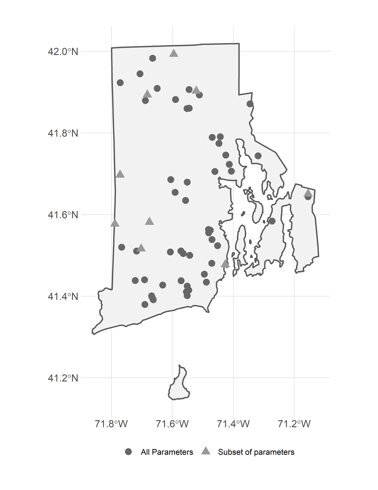
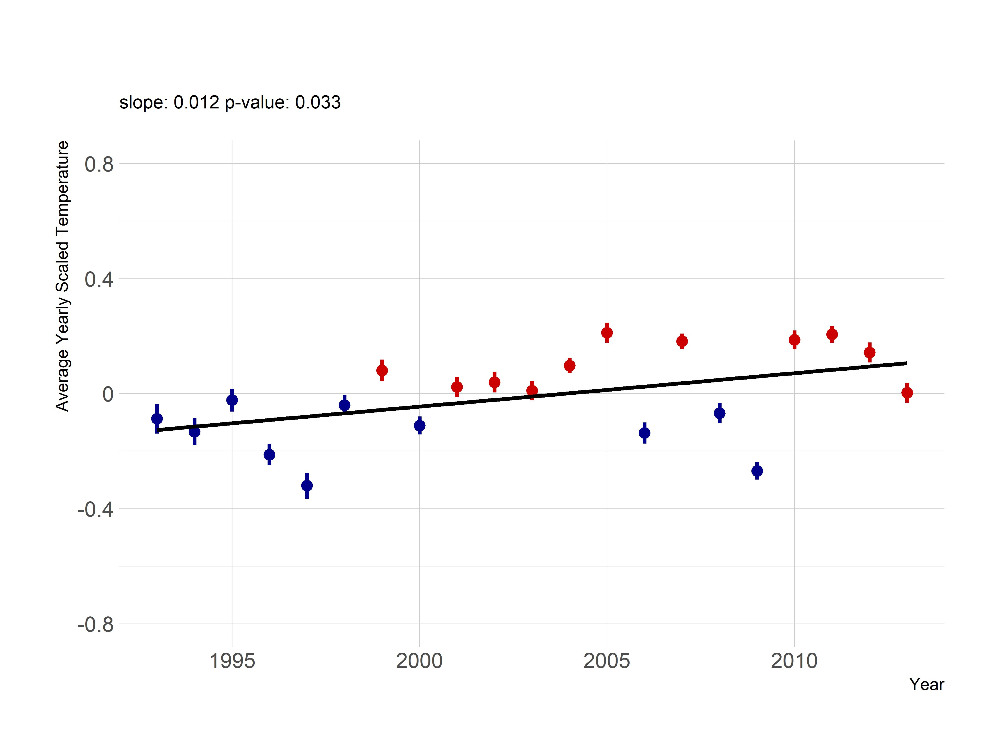
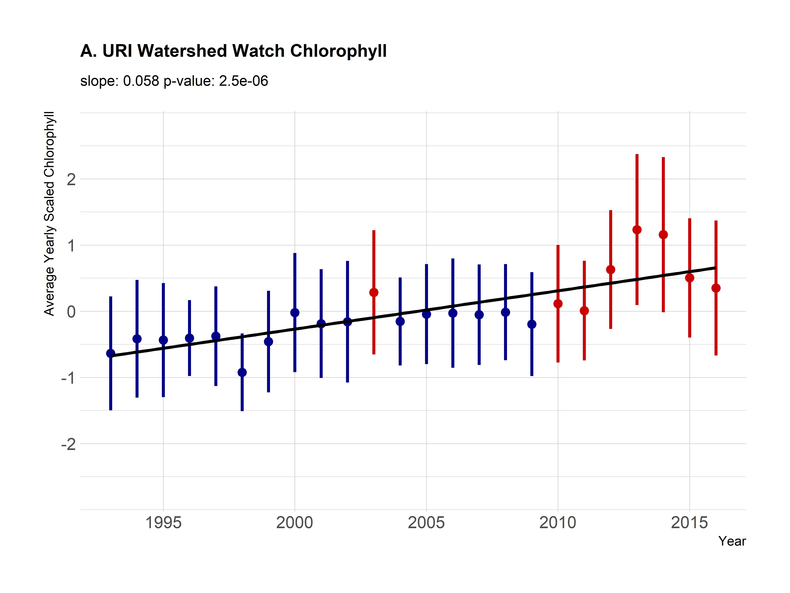
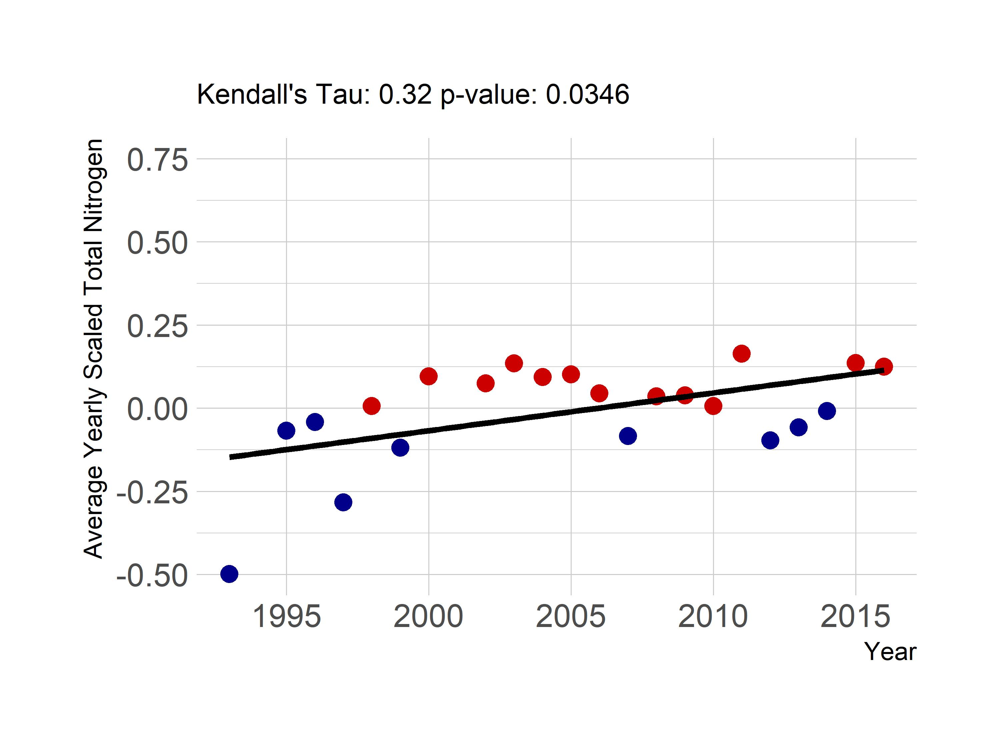
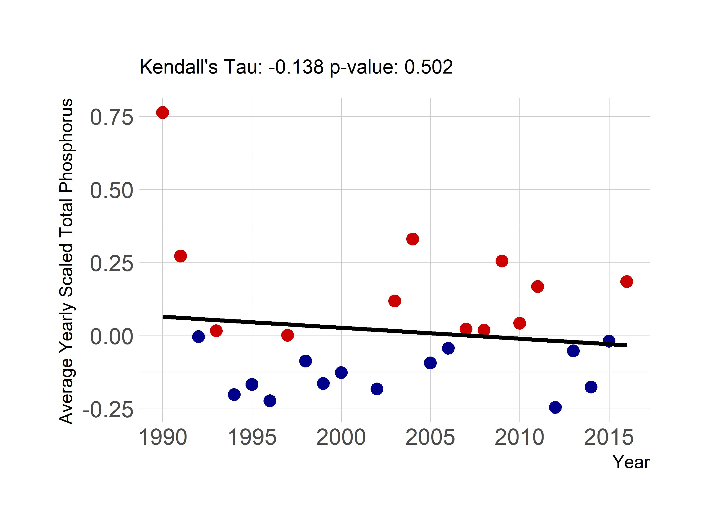
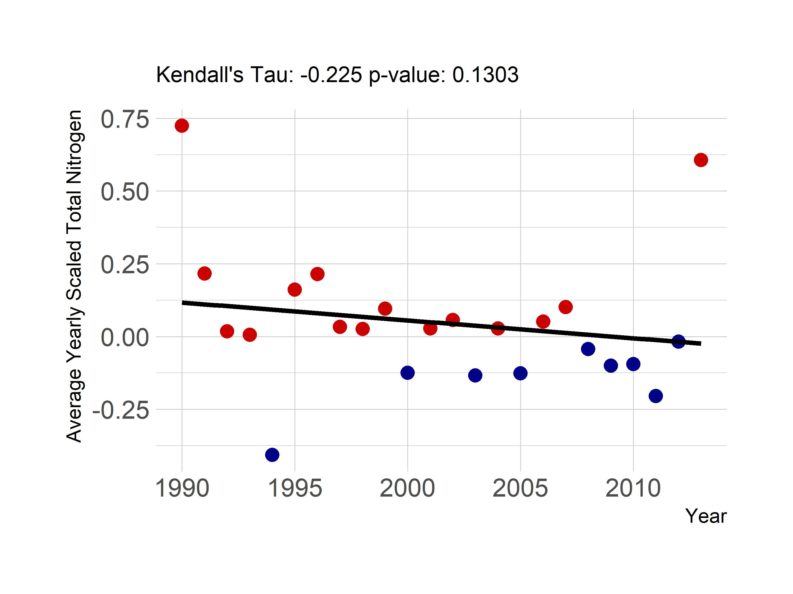
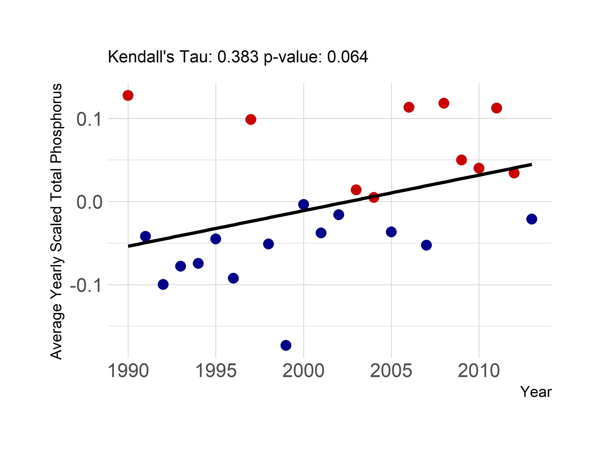
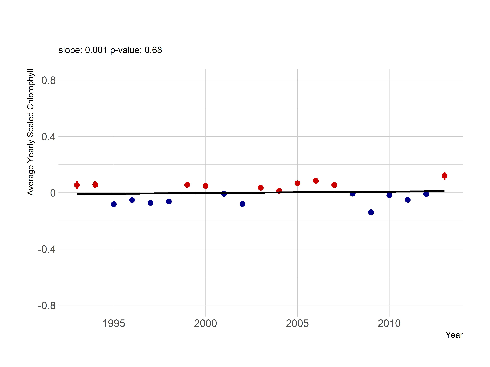

```{r setup, include=FALSE}
library(knitr)
library(captioner)
source(here::here("R/functions.R"), encoding = "UTF-8")
opts_chunk$set(echo = TRUE, fig.width=6, fig.height=5)
tab_num <- captioner(prefix = "Table")
fig_num <- captioner(prefix = "Figure")
```

```{r analysis, include=FALSE}
#got to figure out path stuff before render.
source(here::here("R/data_available.R"), encoding = "UTF-8") 
source(here::here("R/summary_stats.R"), encoding = "UTF-8")  
source(here::here("R/figures.R"), encoding = "UTF-8")
```

# Introduction

General stuff about long-term trends, monitoring programs and watershed watch details


Given what is known about long term trends in water quality within the broader region of the northeastern United States [@Oliver_2017], we were curious if those trends were also present in water quality trends in Rhode Island lakes and ponds.  Something about spatial and temporal variability of water quality

The goals of this study were to look at approximately 25 years of lakes and ponds data in Rhode Island and answer two particular questions.  First, what are the state-wide trends in total nitrogen, total phosphorus, chlorophyll *a*, and lake temperature and second, are water quality trends in Rhode Island similar to regional trends in the northeastern United states.   In addition to these goals, this analysis has also been done using open data from the URI Watershed Watch program and the analysis in its entirety is available for independent reproduction at <https://github.com/usepa/ri_wq_trends>.       

# Methods

For this study we combined a long-term dataset on water quality of lakes in Rhode Island, with a trend analysis based on centered and scaled water quality values (i.e. z-scores) to find increasing or decreasing annual water quality trends.  Details are outlined below.

## Study Area and Data

The study area for this analyis includes data in lakes and ponds in the state of Rhode Island that were collected by the University of Rhode Island's Watershed Watch (URIWW) program (`r fig_num("ww_map", display = "cite", caption = "Map of URI Watershed Watch lake and pond sampling sites")`).  The URIWW is a volunteer monitoring program that has been collecting water quality data from Rhode Island lakes and ponds for over 25 years. The program began in 1988, monitoring 14 lakes and has now grown to include over 250 monitoring sites on over 120 waterbodies, including rivers/streams, and estuaries, with more than 400 trained volunteers. URI WW now provides more than 90% of Rhode Island's lake multi-year baseline data, and is an integral part of the state's environmental data collection strategy. Data QA/QC is of paramount importance; volunteers are trained both in the classroom and the field, and are provided with all the necessary equipment and supplies, along with scheduled collection dates. For freshwater lakes and ponds, weekly secchi depth and water temperature are recorded, along with bi-weekly Chl-a and dissolved oxygen. Water samples are collected three times per season (May through October) to be analyzed in the EPA-certified laboratory for nutrients, alkalinity, pH, and bacteria.

*`r fig_num("ww_map", caption = "Map of URI Watershed Watch lake and pond sampling sites")`*


In particular we selected data from the URIWW data that matched the following criteria: 1) were sampled between 1990 and 2016, 2) were sampled in May to October, 3) and were sampled at a depth of 2 meters or less. For this analysis we were interested in trends in lake temperature, total nitorgen, total phosphorus, and chlorophyll *a* and for each of these parameters we further filtered the data to select sites that had at least 10 years of data for a given parameter.  The final dataset used in our analysis included `r nrow(ww_avail_data_locations)` lakes and ponds which had approximately `r length(temp_10yr_sites)` samples for temperature, `r length(chla_10yr_sites)` samples for chlorophyll *a*, `r length(total_n_10yr_sites)` samples for Total Nitrogen (TN), and `r length(total_p_10yr_sites)` samples for Total Phosphorus (TP).  Of the `r nrow(ww_avail_data_locations)` sampling sites, `r sum(ww_avail_data_locations$params_avail == "chla, total_p, total_n, temp")` had data for all 4 parameters.  

Additionally, prior studies have looked at water quality trends across a larger region of the Northeastern United states that included 17 states including Minnesota, Wisconsin, Iowa, Missouri, Illinois, Indiana, Michigan, Ohio, Pennsylvania, New York, New Jersey, Connecticut, Massachusetts, Rhode Island, Vermont, New Hampshire, and Maine [@soranno2015building; @Oliver_2017].  The authors found little change in water quality trends across this region [@Oliver_2017] .  We repeated our analysis (see **Trend Analysis** section) with the same dataset used by [@Oliver_2017], the LAGOSNE dataset [@soranno2015building; @stacheleklagosne2017; @sorannolagosne2017].  Temperature data were not availble, thus we only examine trends, using our analytical methods, for Total Nitrogren, Total Phosphorus, and Chlorophyll *a* from the LAGOSNE database.

## Trend Analysis

There are many different methods for analyzing time series data for trends.  One of the difficulties that is encountered when you have multiple sampling locations is how to identify a trend when you have variation at the scale of the sampling location as well as variation in when a sampling location might have been addedd to a dataset.  For instance, if you have long-term data on water quality for several ponds, yet the cleaner ponds wer sampled more frequently in early years then a simple comparison of raw-values over time might show a decrease in water quality.  Thus, it is necessary to account for this type of site-specific variation.  This is similar to how the long-term temperature trends are analyzed using temperature anomolies [FILL IN GROUP DOING THIS].  The general approach is to calculate site-specific deviations from a long-term mean over pre-determined reference period.  This allows all sites to be shifted to a common base line and the deviations, or anomalies, show change relative to the reference period.

### Z-score

The anomaly approach is very useful and is the approach we chose to follow.  However, using anomalies works best with a single measure (e.g temperature) or with mulitple measurements that are on the same scale.  The water quality parameters that we explored have different scales and thus the anomaly alone is difficult to interpret across metrics.  For instance, temperature in Rhode Island lakes during the growing season will range from approximately 15 degrees celsius to a high of 30 degrees celsius, whereas phosphorus might range from near zero ug/l to ~900 ug/l.  To standardize these values we used the common approach of dividing each anomlaly by the standard deviation for the reference period.  This value is commonly referred to as a Z-score.  We use these z-scores to examine each water quality variable for a trend over the time period of 1990 to 2016. 

Furthermore, since we are interest in water quality trends over time, we wanted to explore how each site was responding.  Thus, our z-scores were calculated over the reference period, 1990-2016, for each site.  In other words the long-term mean and standard deviation were calculated on a site-by-site basis.    

### Kendall's Tau

Kendall's Tau and the Mann-Kendall test are commonly used to test for monotonic trends water quality data [@mann1945nonparametric; @helsel2002statistical; @hipel1994time].  We followed these standard procedures to test for postive or negative trends in lake temperature, chlorophyll *a*, total nitrogen, and total phosphorus.

### Comparison of Rhode Island to the Region

Prior studies have shown relatively stable water quality in the lakes of the Northeastern United Sates [@Oliver_2017].  The data we used in our analysis, the University of Rhode Island's Watershed Watch data, was inlcuded in that, but we were curious if regional trends were masking local scale trends in Rhode Island.  In addition to the analysis condcuted by Oliver et al. [-@Oliver_2017], we analyzed the same dataset but using the approach outlined here.

# Results

During the sampling period of 1990 to 2016 Rhode Island lakes and ponds average lake temperature was `r paste(ww_param_ranges%>%filter(Parameter == "temp")%>%pull(Mean), ww_param_ranges%>%filter(Parameter == "temp")%>%pull(Units))`, average total nitrogen was `r paste(ww_param_ranges%>%filter(Parameter == "total_n")%>%pull(Mean), ww_param_ranges%>%filter(Parameter == "total_n")%>%pull(Units))`, average total phosphorus was `r paste(ww_param_ranges%>%filter(Parameter == "total_p")%>%pull(Mean), ww_param_ranges%>%filter(Parameter == "total_p")%>%pull(Units))`, and average chlorophyll was `r paste(ww_param_ranges%>%filter(Parameter == "chla")%>%pull(Mean), ww_param_ranges%>%filter(Parameter == "chla")%>%pull(Units))` (`r tab_num("ww_params", display = "cite", caption = "Summary statistics for URI Watershed Watch data from 1990 to 2016.")`).  

*`r tab_num("ww_params")`*

```{r ww_params, echo=FALSE, results="asis"}
knitr::kable(ww_param_ranges, format = "markdown")
```

For lakes in ponds in the larger region represented by the LAGOSNE States,  average total nitrogen was `r paste(lagos_param_ranges%>%filter(Parameter == "total_n")%>%pull(Mean), lagos_param_ranges%>%filter(Parameter == "total_n")%>%pull(Units))`, average total phosphorus was `r paste(lagos_param_ranges%>%filter(Parameter == "total_p")%>%pull(Mean), lagos_param_ranges%>%filter(Parameter == "total_p")%>%pull(Units))`, and average chlorophyll was `r paste(lagos_param_ranges%>%filter(Parameter == "chla")%>%pull(Mean), lagos_param_ranges%>%filter(Parameter == "chla")%>%pull(Units))` (`r tab_num("lagos_params", display = "cite", caption = "Summary statistics for URI Watershed Watch data from 1990 to 2016.")`).    

*`r tab_num("lagos_params")`*

```{r lagos_params, echo=FALSE, results="asis"}
knitr::kable(lagos_param_ranges, format = "markdown")
```

## State-wide trends in water quality

Average yearly scaled temperature in lakes and ponds appear to be increasing (Kendall's Tau: `r round(ww_temp_kt$tau,3)` , p-value: `r round(ww_temp_kt$sl, 4)`) with the large majority of years with average temperature greater than the long term average occuring in the years since 2000 (`r fig_num(name = "temp_ri", caption = "Yearly trend over 20+ years of lake temperature in Rhode Island lakes and ponds.", display = "cite")`).  Chlorophyll *a* is also showing an increasing trend over time (Kendall's Tau: `r round(ww_chla_kt$tau,3)` , p-value: `r round(ww_chla_kt$sl, 4)`) and with the exception of an early high chlorophyll *a* year in 1992 and a slightly above average year in 2003, the above average years have all occurred since 2010 (`r fig_num(name = "chla_ri", caption = "Yearly trend over 20+ years of Chlorphyll a (average z-score) in Rhode Island lakes and ponds.", display = "cite")`). 

*`r fig_num(name = "temp_ri")`*



*`r fig_num(name = "chla_ri")`*



```{r no_early_tn, echo=FALSE}
ww_tn_kt_no9394 <- Kendall(ww_tn_df[c(-1,-2),]$year, ww_tn_df[c(-1,-2),]$mn_value)
```

Average yearly trends for nutrients showed weaker or no trends over time.  Total nitrogen did have a significant trend (Kendall's Tau: `r round(ww_tn_kt$tau,3)` , p-value: `r round(ww_tn_kt$sl, 4)`); however, that trend is driven by the lower than average total nitrogen values in 1993 and 1994 (`r fig_num(name = "tn_ri", caption = "Yearly trend over 20+ years of Total Nitrogen (average z-score) in Rhode Island lakes and ponds.", display = "cite")`).  Since 1995, the yearly trend is not significant (Kendall's Tau: `r round(ww_tn_kt_no9394$tau,3)` , p-value: `r round(ww_tn_kt_no9394$sl, 4)`).  Total phosphorus does not show a trend over time in the yearly scaled values (Kendall's Tau: `r round(ww_tn_kt$tau,3)` , p-value: `r round(ww_tn_kt$sl, 4)`) and years that are over or under the average are evenly distributed over the years (`r fig_num(name = "tp_ri", caption = "Yearly trend over 20+ years of Total Phosphorus (average z-score) in Rhode Island lakes and ponds.", display = "cite")`). 

*`r fig_num(name = "tn_ri")`*



*`r fig_num(name = "tp_ri")`*



## Regional trends in water quality

(`r fig_num(name = "tn_lagos", caption = "Yearly trend over 20+ years of Total Nitrogen (average z-score) in the LAGOSNE states.", display = "cite")`).

*`r fig_num(name = "tn_lagos")`*



(`r fig_num(name = "tp_lagos", caption = "Yearly trend over 20+ years of Total Phosphorus (average z-score) in the LAGOSNE states.",display = "cite")`).

*`r fig_num(name = "tp_lagos")`*



(`r fig_num(name = "chla_lagos", caption = "Yearly trend over 20+ years of Chlorophyll a (average z-score) in the LAGOSNE states.", display = "cite")`).

*`r fig_num(name = "chla_lagos")`*



# Discussion and conclusions

## Trends

### Local scale vs Regional/Global scale

### RI is downstream - Bryan will write

## Caveats

# Bibliography
