```{r setup, include=FALSE}
knitr::opts_chunk$set(echo = FALSE)
```


## What drives changes in lake productivity?
::::::::::::::{.columns}
:::{.column}
- Nutrients
- Temperature
- Other things
:::
:::{.column}

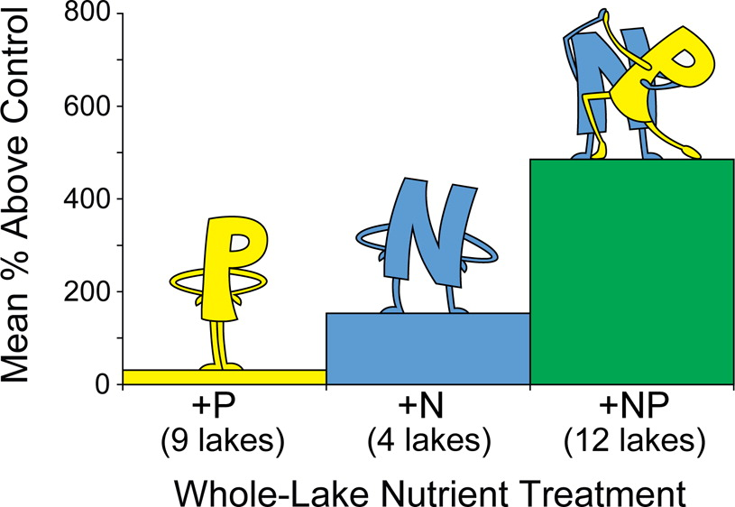

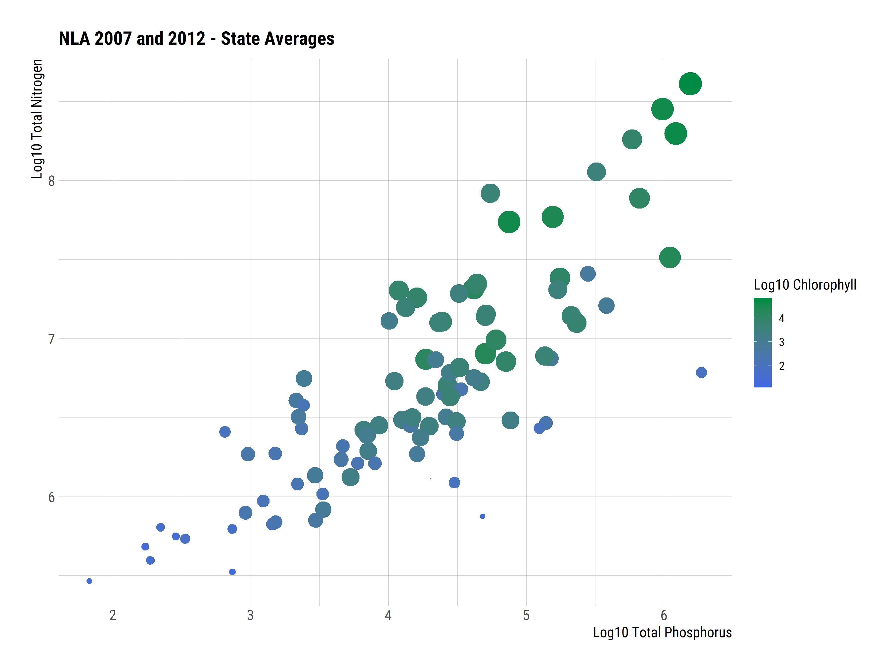

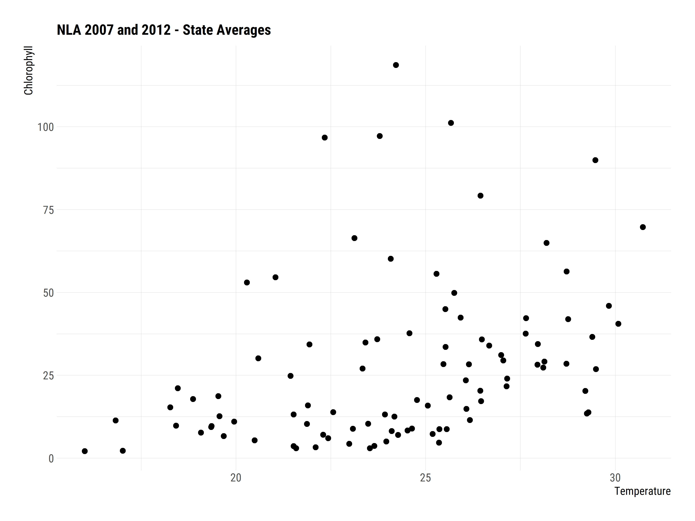
:::
::::::::::::::

## The management problem

- Desire to reduce and manage nutrient pollution
- Phosphorus Bans
- Nutrient Criteria
- Enacted piecemeal over last ~20 years
- Do the data show any change?

## Stasis in Northeast

- Oliver et al (2017) Unexpected stasis in a changing world: Lake nutrient and
chlorophyll trends since 1990. Global Change Biology. DOI: 10.1111/gcb.13810

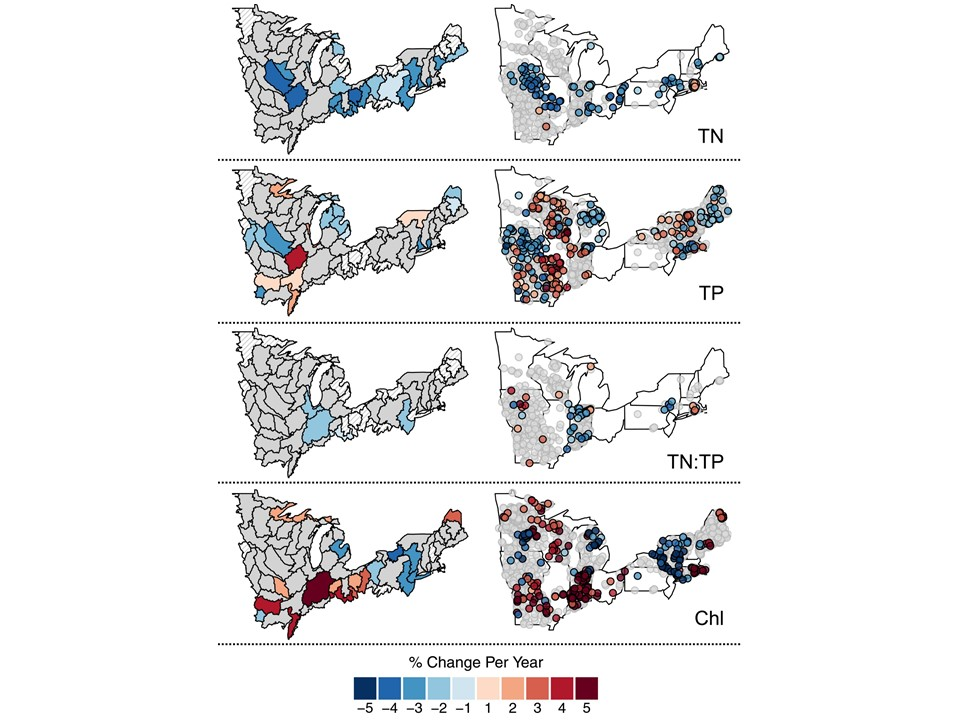

## But change at other scales

- Mathews et al (2018) Is Vermont losing its oligotrophic lakes?. LakeLine. 38-2.
- Rhode Island?


## URI Watershed Watch

- Volunteer monitoring program
  - ~400 volunteers
- Started in 1988 with 14 lakes
- Now
  - 250+ sites
  - 120+ waterbodies
- Rigorous QA/QC
- Data used by RI DEM and US EPA

## URI Watersehd Watch: Lake Sampling

- May to October
- Weekly
  - Water Clarity
  - Temperature
- Every Other Week
  - Chlorophyll
  - Dissolved Oxygen
- 3 Times per Season
  - Nutrients
  - Alakalinity
  - pH
  - Bacteria
  
## URI Watershed Watch: Filtered for Trend Analysis

- Parameters: Total Nitrogen, Total Phosphorus, N:P, Temperature, Chlorophyll
- Years: 1993 to 2016
- Months: May through October
- Depths: <= 2 meters
- Sites: At least 10 years of data
- Total of 69 Sites

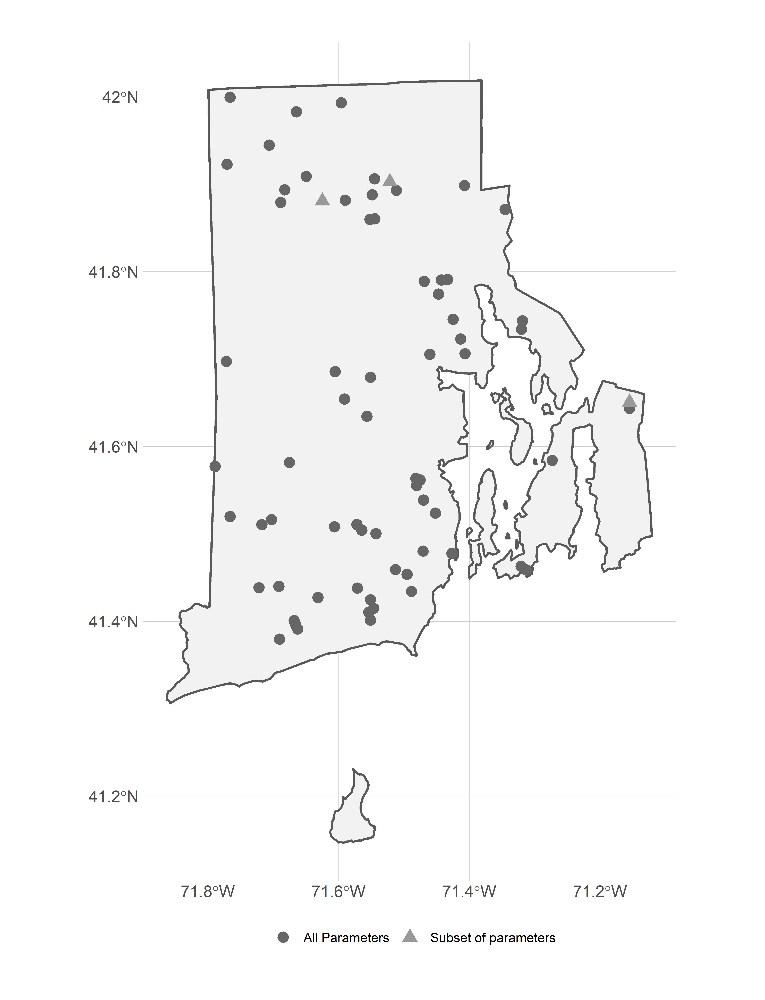

## LAGOSNE

## Analysis: Site-specific z-scores

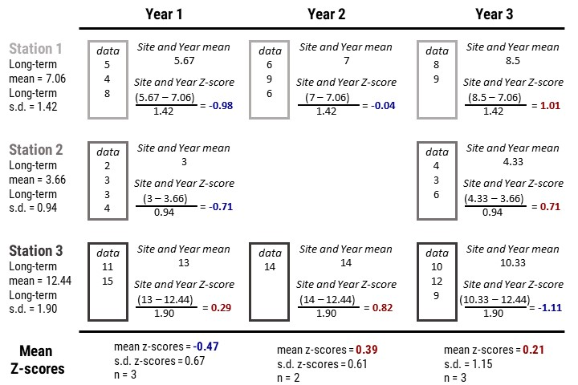

## Analysis: Yearly trends

## Results: Nitrogen trends

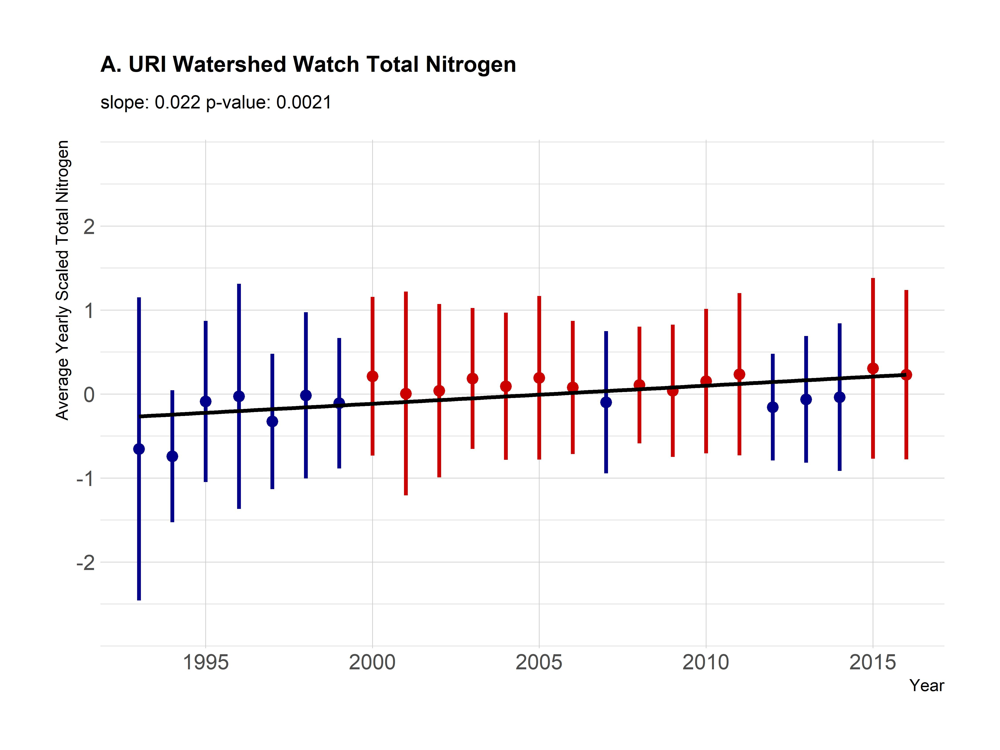

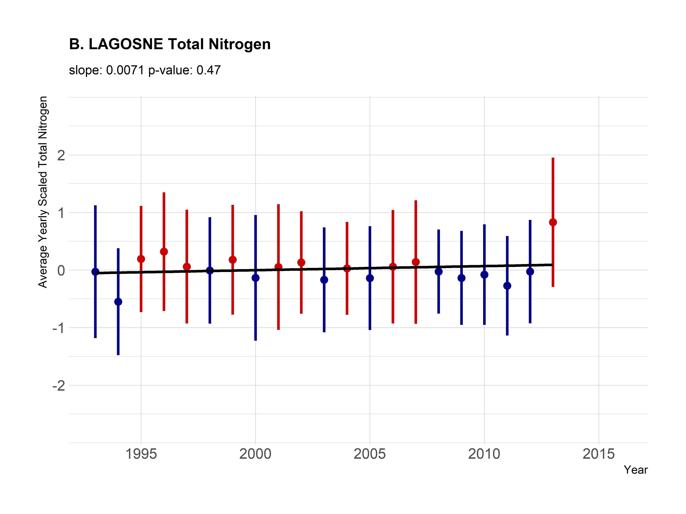

## Results: Phosphorus trends

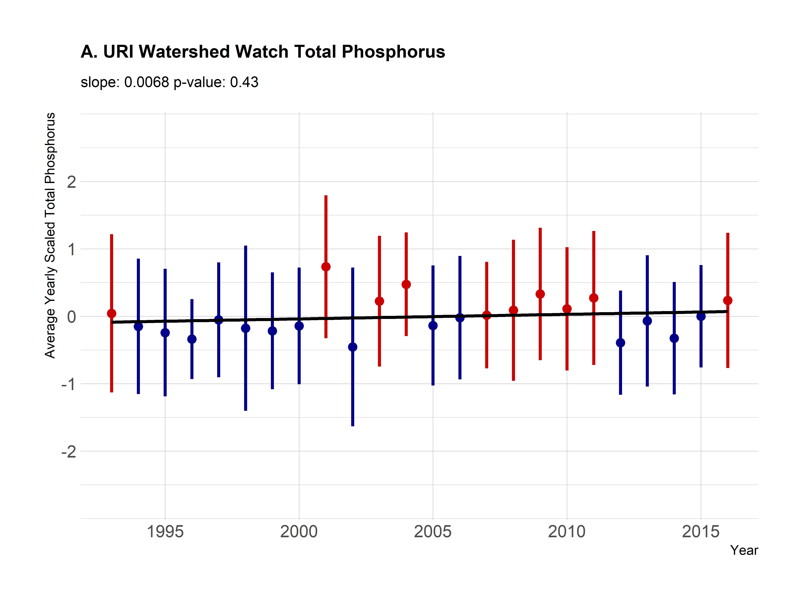


## Results: N:P trends


## Results: Chlorophyll trends

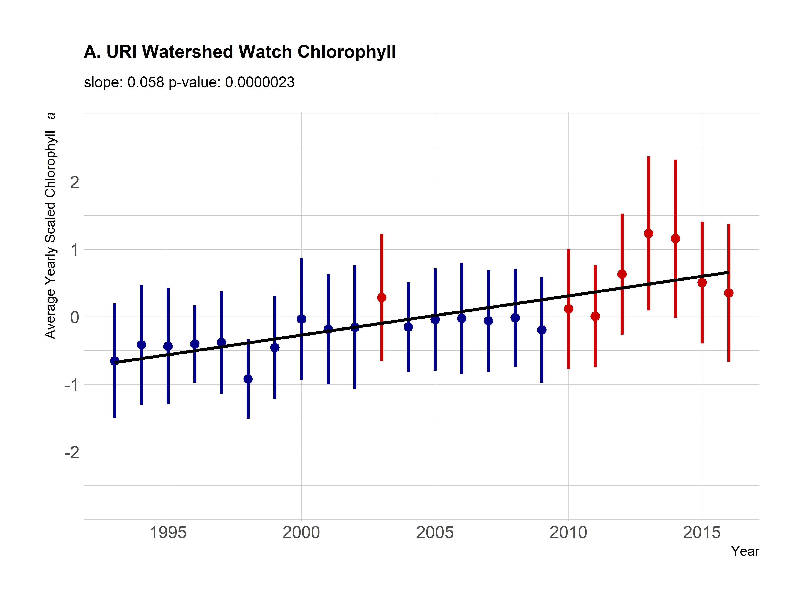

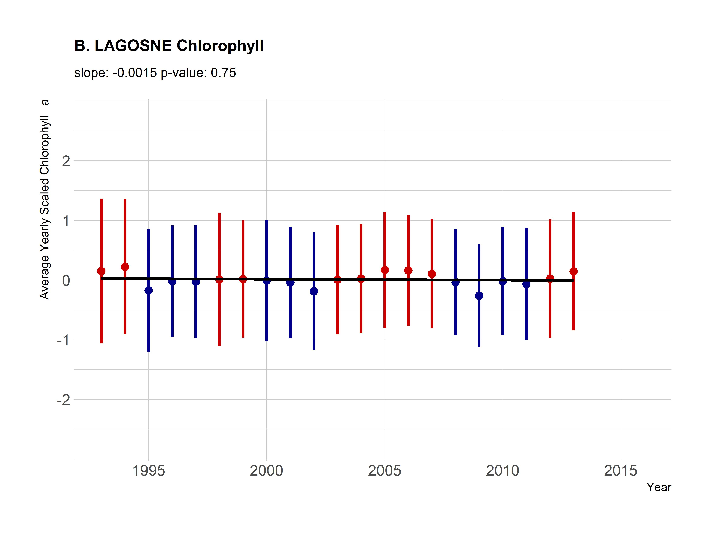

## Results: Temperature trends


## Conclusions

### In Rhode Island
- More chlorophyll
- More heat
- Nutrients not changing much

### Within the Northeast
- Stasis (our analysis concurs)

## Thank you and Questions