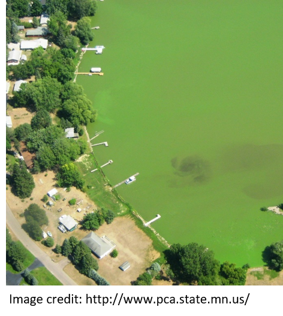
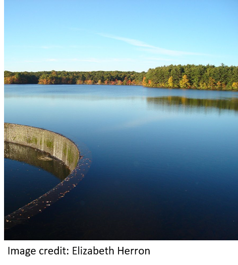
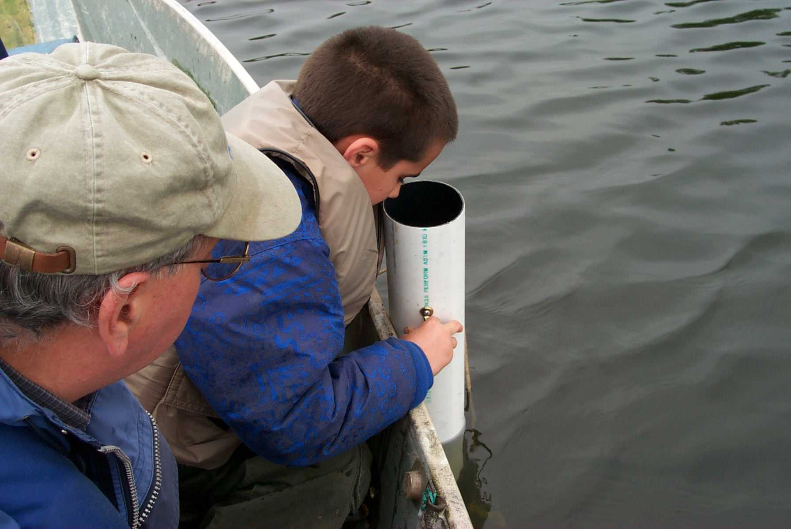
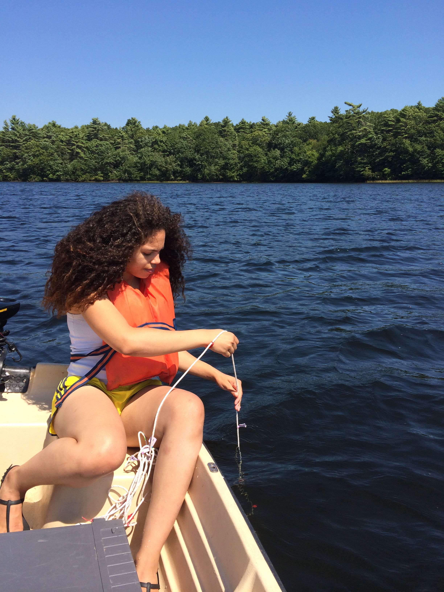
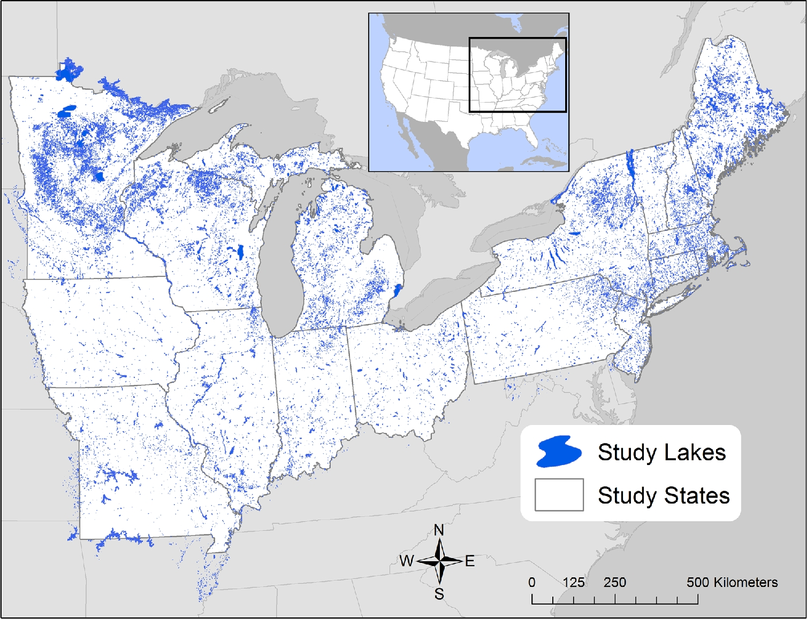

```{r setup, include=FALSE}
knitr::opts_chunk$set(echo = FALSE)
```


## What drives changes in lake productivity?
::::::::::::::{.columns}
:::{.column}
- Nutrients
- Temperature
- Other things
:::
:::{.column}


:::
::::::::::::::

## The management problem

- Desire to reduce and manage nutrient pollution
- Phosphorus Bans
- Nutrient Criteria
- Enacted piecemeal over last ~20 years
- Do the data show any change?





## Stasis in Northeast

- Oliver et al (2017) Unexpected stasis in a changing world: Lake nutrient and
chlorophyll trends since 1990. Global Change Biology. DOI: 10.1111/gcb.13810


## But change at other scales

- Mathews et al (2018) Is Vermont losing its oligotrophic lakes?. LakeLine. 38-2.
- Rhode Island?


## URI Watershed Watch

- Volunteer monitoring program
  - ~400 volunteers
- Started in 1988 with 14 lakes
- Now
  - 250+ sites
  - 120+ waterbodies
- Rigorous QA/QC
- Data used by RI DEM and US EPA


## URI Watersehd Watch: Lake Sampling

- May to October
- Weekly
  - Water Clarity
  - Temperature
- Every Other Week
  - Chlorophyll
  - Dissolved Oxygen
- 3 Times per Season
  - Nutrients
  - Alakalinity
  - pH
  - Bacteria


  


## URI Watershed Watch: Filtered for Trend Analysis

- Parameters: Total Nitrogen, Total Phosphorus, N:P, Temperature, Chlorophyll
- Years: 1993 to 2016
- Months: May through October
- Depths: <= 2 meters
- Sites: At least 10 years of data
- Total of 69 Sites
  - 66 with all parameters
  - 1 without N:P
  - 2 without chlorophyll and temperature


## LAke mult-scaled GeOSpatial and temoporal database for the Northeastern US (LAGOS-NE)

- Soranno et al (2017). LAGOS-NE: a multi-scaled geospatial and temporal database of lake ecological context and water quality for thousands of US lakes. Gigascience, 6(12)
- Stachelek and Oliver (2017). LAGOSNE: Interface to the lake multi-scaled geospatial and temporal database. R package version 1.1.0. https://cran.r-project.org/package=LAGOSNE
- <https://lagoslakes.org/>
- 17 States: CT, IL, IN, IA, ME, MA, MI, MN, MO, NH, NJ, NY, OH, PA, RI, VT, WI
- ~ 50,000 Lakes



## LAke mult-scaled GeOSpatial and temoporal database for the Northeastern US (LAGOS-NE): Filtered for Trend Analysis

- Parameters: Total Nitrogen, Total Phosphorus, N:P, Chlorophyll
  - Temperature data not currently available
- Years: 1993 to 2016
- Months: May through October
- Depths: <= 2 meters
- Sites: At least 10 years of data
- Total of 1482 Sites
  - 637 with chlorophyll and phosphorus
  - 377 with only chlorophyll
  - 275 with only phosphorus
  - 161 with all variables (except temperature)
  - 25 with chlorophyll and nitrogen
  - 7 with other combination of nutrients


## Analysis: Site-specific z-scores and yearly trends

- Calculate average yearly z-score
- Look for monotonic yearly trend
  - Slope of regression line 


## Results: Nitrogen trends

- RI: Increasing but driven by low years in 1993 and 1994
  - Without those years slope = 0.01 and p-value = 0.06
- LAGOSNE: Static


## Results: Phosphorus trends

- RI: Static
- LAGOSNE: Static


## Results: N:P trends

- RI: Static
- LAGOSNE: Static


## Results: Chlorophyll trends

- RI: Increasing
- LAGOSNE: Static


## Results: Temperature trends

- RI: Increasing
- LAGOSNE: NA


## Conclusions

### In Rhode Island
- More chlorophyll
- More heat
- Nutrients not changing much

### Within the Northeast
- Stasis
  - Our results concur with Oliver et al. (2017)

## Thank you and Questions

